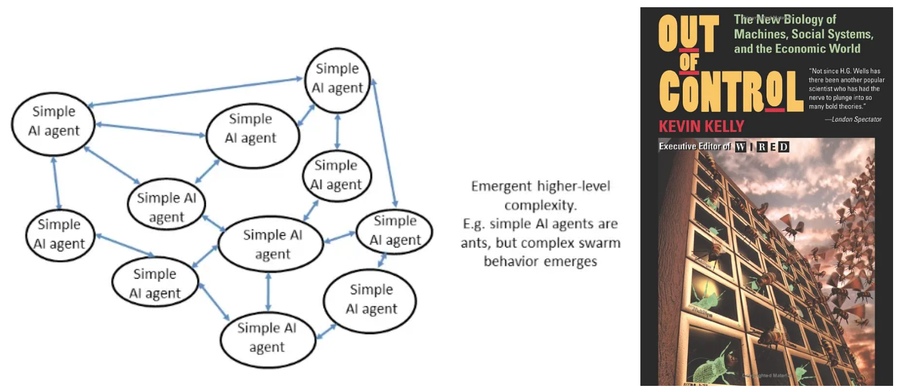

# Predictoor Parameters

## Feeds Published
For testnet, there are 10 feeds: X/USDT pair for each of the top-10 coins by market cap (ignoring stablecoins), 5m timescales, on Binance, >0% fees on Binance. Paid feeds. The coins are: X = BTC, ETH, BNB, XRP, ADA, DOGE, SOL, LTC, TRX, DOT

For mainnet, tentatively, there will be 20 feeds:  
- 10x at 5m timescales like above  
- 10x at 60m timescales like above  

## Pricing
The price to subscribe to one feed for 24 hours is 3.00 OCEAN. This includes all fees.  

Fee details:
- 0.1% community swap fee  
- 20% fee to Ocean Protocol Foundation. (Will be used to further drive Predictoor, and to burn OCEAN.)  
- For reference, price without fees is 2.49791840133 OCEAN. To calculate this: Let x = price without fees. Then x * (1 + 0.20 + 0.001) = 3.0 → x = 3.0 / (1 + 0.20 + 0.001) = 2.49791840133  

Pricing is subject to change based on learnings, and feedback from community.  

## Predictoor Data Farming
[Ocean Data Farming](https://df.oceandao.org/rewards) (DF) is an incentives program currently with [150K OCEAN rewards](../rewards/df-intro.md#reward-schedule) per week.

In Nov 2nd, a reward stream will be introduced to incentivize predictoors. This reward stream will provide 37,000 OCEAN in weekly rewards. You can find more about it in [Data Farming Intro - What are Active Rewards?](../rewards/df-intro.md#what-are-active-rewards)

# Possible Futures
This first release of Predictoor is just the beginning. We anticipate adding many more crypto feeds: more coins, more exchanges (CEX and DEX), more timescales; and predictions beyond just coin prices.

We envision the Predictoor stack being used in other verticals like real estate, weather, climate, transportation, and agriculture. We envision refinements of the core Predictoor technology.

Predictoor’s predictions are the final step of the web3 data value creation pipeline, right before action is taken and \$ is made. We anticipate that the \$ made by Predictoors will filter upstream, into work to create feeds used by Predictoors, such as sentiment analysis, volatility, and information ticks.

Most interestingly, the agents of the Predictoor ecosystem may evolve. Starting as relatively simple agents running on the centralized cloud, Predictoor’s incentives can drive them to becoming decentralized and autonomous, while performing AI. Yes, [AI DAOs](https://medium.com/@trentmc0/ai-daos-and-three-paths-to-get-there-cfa0a4cc37b8). Swarms of sovereign agents: some predicting, some trading, and some providing support services along the data supply chain. It will feel a bit like [nature](https://blog.oceanprotocol.com/nature-2-0-27bdf8238071), a bit [out of control](https://www.amazon.de/-/en/Kevin-Kelly/dp/0201483408), and wholly exciting!

<figure><figcaption>Left: a swarm/agent-based AI DAO architecture. Right: book cover for Out of Control by Kevin Kelly
</figcaption></figure>