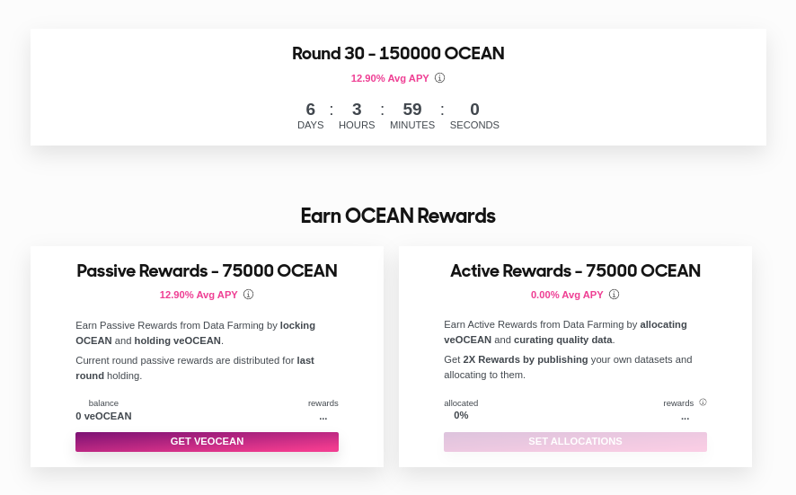

# Data Farming Rewards 💰

### Why did we create the Data Farming dApp?

The purpose of Ocean Protocol's Data Farming dApp reward system is to incentivize the growth, curation, and publishing of high-quality data NFTs in the Ocean Ecosystem.  

Data Farming participants earn OCEAN rewards for these activities.
Data Farming rewards are structured in 2 main streams **Passive Rewards** and **Active Rewards**. At a minimum, Data Farmers earn "passive rewards" for locking their OCEAN tokens to get veOCEAN tokens in return. Then, Data Farmers can maximize their yield by earning "active rewards". Active Rewards stream it's broken down into multiple substreams, to offer you a variaty of ways to contribute to Ocean Protocol values and increase your Data Farming rewards: Volume DF, Challenge DF.

## veOCEAN

Learning about [veOCEAN](df-veocean.md) will help you answer the question "What is the purpose of holding veOCEAN?" & give insights on how veOCEAN (vote-escrowed OCEAN) works. It will teach you everything you need to know about why it exists and how it works.

You will learn that by just holding veOCEAN passively, you are able to rewards.

veOCEAN is a fork of veCRV. This enables participants to become a governance delegate, and eligible to receive rewards and engage with different protocol mechanisms.

## Data Farming

[Data Farming 101](df-intro.md) introduces the different reward systems, how they work, and how to access them. By the end of the page, you should be more familiar with how Data Farming works and able to take next steps to curate assets.

[Data Farming Background](df-max-out-yield.md) will provide you with more intuitions about Data Farming, briefly explain the Reward Function, and how the program evolved over time.

## Delegation

[Delegation](..user-guides/data-farming/how-to-farm-delegate.md) will teach you how to share your veOCEAN allocation power to other users that can help manage Volume DF substream for you.

Once delegated, rewards will be sent to the wallet address you delegated to. The delegation receiver is in charge of managing your Allocation Power and cut from the rewards.

## Further Reading

Finally, if you want to continue expanding your knowledge on OCEAN token emissions, APY estimates, and get useful answers to some of the most common questions, you can read the following:

[Emissions & APYs](df-emissions-apys.md) will provide you will information about how OCEAN will be released over time through the Data Farming program and provide you with APY studies.

Our [FAQ](../discover/faq.md) answers many different questions about staking, chains, deployments, and other details that may be valuable to you.

## Reference

All content within has been assembled via reference of the [Ocean Data Farming Series](https://blog.oceanprotocol.com/ocean-data-farming-series-c7922f1d0e45), official [Ocean Protocol github repositories](https://github.com/oceanprotocol/), and [v4 Whitepapers](https://oceanprotocol.com/tech-whitepaper.pdf).
