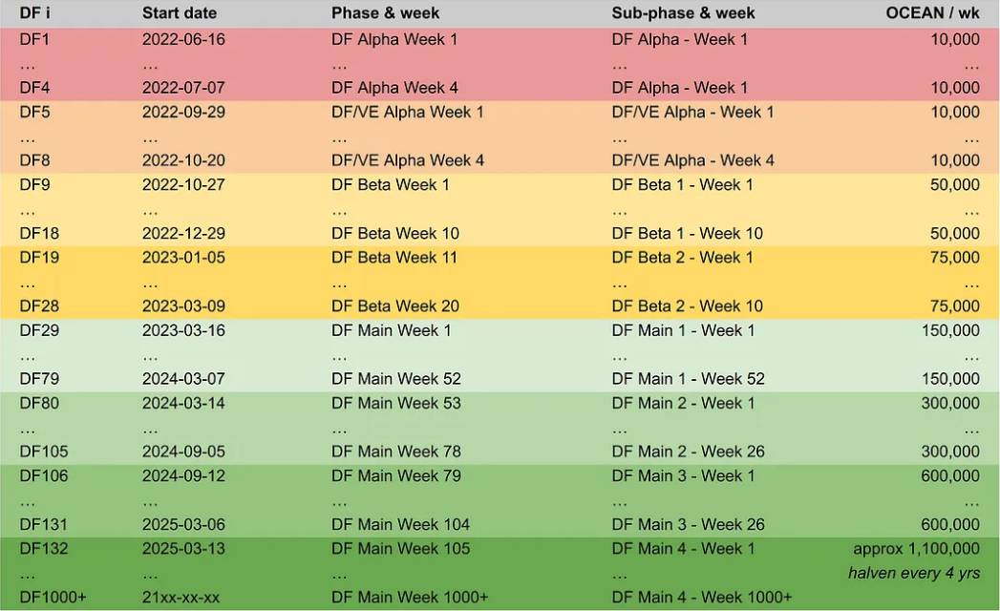

# Data Farming (Blue Belt)

<figure><figcaption>
Like Neo, you have great potential.
</figcaption></figure>

Data Farming rewards OCEAN to participants as a function of consume volume and liquidity. It’s like DeFi liquidity mining, but tuned for asset consumption. Data Farming's aim is to achieve a minimum supply of data for network effects to kick in, and once the network flywheel is spinning, increase the growth rate.

## Max Out Your Yields

Data Farming is not a wholly passive activity. The name of the game is to drive Data Consume Volume (DCV). High APYs happen only when there is sufficiently high DCV. High DCV means publishing and consuming truly useful datasets (or algorithms).

Thus, if you really want to max out your APY:

1. Create & publish datasets (and make $ in selling them) — or work with people who can
2. Lock OCEAN and stake veOCEAN on them.
3. Buy the datasets (and use them to make $) — or work with people who can
4. Claim the rewards.

Driving DCV for publishing & consuming is your challenge. It will take real work. And then the reward is APY. It’s incentives all the way down :)

### Measuring Data Farming's Success

**Data Consume Volume (DCV)** is a metric for **the total $ amount spent on purchases of Ocean Market assets**, transaction fees, and more. As Ocean Market assets are purchased (i.e. consumed), then the more OCEAN rewards are distributed to Data Farmers.

## Reward Function

The Reward Function (RF) governs how active rewards are allocated to stakers.

Rewards are calculated as follows:

1. Distribute OCEAN across each asset based on rank: highest-DCV asset gets most OCEAN, etc.
2. For each asset and each veOCEAN holder: – If the holder is a publisher, 2x the effective stake – Baseline rewards = (% stake in asset) \* (OCEAN for asset) – Bound rewards to the asset by 125% APY – Bound rewards by asset’s DCV \* 0.1%. This prevents wash consume.

You can find this code inside [calcrewards.py](https://github.com/oceanprotocol/df-py/blob/main/util/calcrewards.py) in the Ocean Protocol [df-py repo](https://github.com/oceanprotocol/df-py/)

### Ranked Rewards

In DF23 Ranked Rewards were introduced and smooth the reward distribution by using a logarithmic function.

**Since rewards are distributed across the Top 100 assets, all participants (Publishers & Curators) are now incentivized to support a broader range of assets rather than optimizing on a single asset.**

At the top-end, this helps increase quality and diversification of inventory.

At the bottom-end, this eliminates some potential free-rider issues and smooths out the reward distribution.

You can read more about the implementation [in this blog post](https://blog.oceanprotocol.com/data-farming-df22-completed-df23-started-reward-function-tuned-ffd4359657ee) and find the full study [in these slides](https://docs.google.com/presentation/d/1HIA2zV8NUPpCELmi2WFwnAbHmFFrcXjNQiCpEqJ2Jdg/).

## Data Assets that Qualify for DF

Data assets that have veOCEAN allocated towards them get DF rewards.

The data asset may be of any type — dataset (for static URIs), algorithm for Compute-to-Data, or any other Datatoken token-gated system. The data asset may be fixed price or free price. If fixed price, any token of exchange is alright (OCEAN, H2O, USDC, ..).

To qualify for DF, a data asset must also:

* Have been created by Ocean Smart contracts [deployed](https://github.com/oceanprotocol/contracts/blob/v4main/addresses/address.json) by OPF to [production networks](https://docs.oceanprotocol.com/discover/networks)
* Be visible on [Ocean Market](https://market.oceanprotocol.com/)
* Can’t be in [purgatory](https://github.com/oceanprotocol/list-purgatory/blob/main/policies/README.md)

## 4 Phases of Data Farming

Data Farming has evolved over time and will continue to do so as the Emission Curve progresses. We are now in DF main, below are the previous phases and parameters incurred during the evolution of the Data Farming program.

**DF Alpha - Rounds 1-4 (4 wks)**\
10K OCEAN rewards were budgeted per week. Counting started Thu June 16, 2022 and ended July 13, 2022. Rewards were distributed at the end of every week, for the activity of the previous week. It ran for 4 weeks. The aim was to test technology, learn, and onboard data publishers.

**DF/VE Alpha - Rounds 5-8 (4 wks)**\
10K OCEAN rewards were budgeted per week. Counting started Thu Sep 29, 2022 and ended Oct 27, 2022. Rewards were distributed at the end of every week, for the activity of the previous week. It ran for 4 weeks. The aim was to resume Data Farming along with veOCEAN, test the technology, onboard data publishers, and keep learning.

**DF Beta - Rounds 9-28 (20 wks)**\
Up to 100K OCEAN rewards were budget per week. Counting started Thu Oct 27, 2022 and ended March 15, 2023. It ran for 20 weeks. The aim was to test the effect of larger incentives, support ecosystem participation, while continue refining the underlying technology.

**DF Main - Rounds 29-1000+**\
Immediately followed the release of DF Beta on Thu Mar 16, 2023. Rewards begin at 150k per week and go to 1.1M OCEAN per week. DF Main emits 503.4M OCEAN worth of rewards and lasts for decades. Expected APY is 125% over many months (once fully ramped), staying generous over the long term.

The amount of OCEAN released is determined by the emission schedule as defined by the [Emission Curve](emissions-apys.md#emissions--apys), and perhaps more easily understood in the Reward Schedule (see below).

#### Reward Schedule

The table below cross-references DF Round Number, Start Date, Phase & Week, Sub-Phase & Week, and OCEAN Rewards/Week.

<figure><figcaption>
 <em>Ocean Reward Schedule for the next 20+ years</em>
</figcaption></figure>
