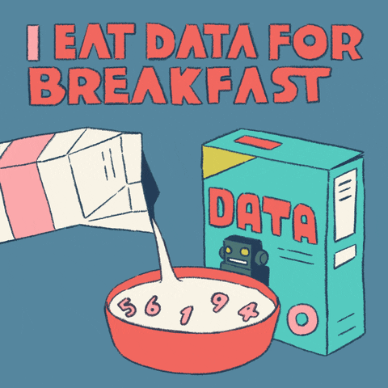

# Win Competitions in Challenge DF

<figure><figcaption>
Let's consume some data.
</figcaption></figure>

## Publish prediction models and earn rewards

If you're eager to consume data and create valuable assets for publishing but unsure of where to begin, fear not! We've got you covered.

Data Farming offers rewards to data scientists who participate in weekly challenges. We provide the rules and rewards, allowing you to focus on delivering high-quality results.  

**Prizes:**
- 1st Place - 2500 OCEAN
- 2nd Place - 1500 OCEAN
- 3rd Place - 1000 OCEAN

_Total - 5000 OCEAN_

### What are the base rules?

- A fresh challenge [begins and concludes every Thursday](df-intro.md#weekly-rounds).
- You have to submit your entry before the deadline.
- At the beginning of each week, a predetermined amount of OCEAN is allocated as rewards.
- Competitors need to submit 12 predictions by using a DataNFT to share data.
- The rewards are divided into specific amounts for the top three positions.
- The individuals who submit the top three entries will receive rewards, and their wallet addresses will be showcased within the Data Farming dapp.

For the full details on how to submit, please read the [Where to start](#where-to-start) section.

### What do I gain from this?

- Earn OCEAN rewards, [claimable inside the app](https://df.oceandao.org/rewards)
- Gain in-depth knowledge of the Ocean Protocol stack.
- Increase your visibility by achieving a place on the podium.
- Create valuable assets that can be monetized on the Ocean Marketplace.
- Enhance your skills and engage in friendly competition with other participants.

### Where to start?

Head over to the [Challenges Page](https://df.oceandao.org/challenge-df) to learn more about Challenge DF, see historical results, and find out where you go to submit.

If you're looking for a step-by-step guide on what a challenge entails and how to claiming your well-deserved rewards, check out the [Challenge DF  user guide](user-guides/how-to-challengedf.md). It will provide you with all the necessary information you need to make the most out of the challenges.

You can find a direct link to the [Challenge DF README](https://github.com/oceanprotocol/predict-eth/blob/main/challenges/challenge-df.md) which you'll be using to submit your predictions.

### Good lock and happy coding!

<figure><figcaption></figcaption></figure>
