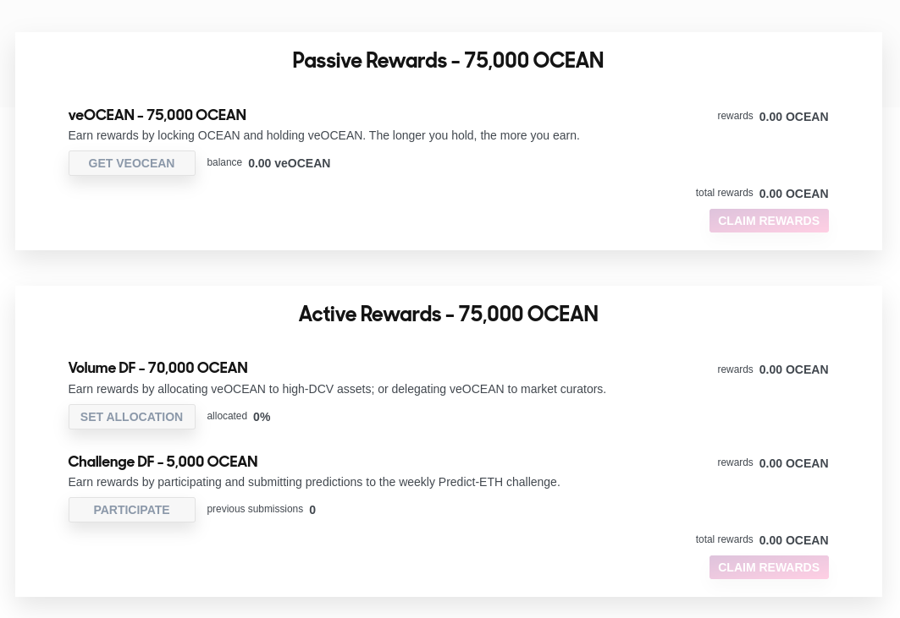

# Data Farming 101

<figure><figcaption>
Meet your sensei.
</figcaption></figure>

## Weekly Rounds

All streams and substreams repeat on a weekly basis that start on Thursdays 00:00 at UTC and end on Wed at 23:59 UTC.  

### Passive and Active Reward streams

OCEAN rewards are paid out at the end of each week to Data Farmers through two different reward streams. **Passive Rewards** and **Active Rewards**.  

These two reward streams produce different variable APYs.  

Rewards are paid out at the end of each round.

#### Splitting the Pie

Each Data Farming round has a pool of OCEAN rewards, where 50% of the pool is paid out in the form of passive rewards & 50% in the form of active rewards that [can be viewed here](https://df.oceandao.org/rewards).

| Passive Rewards | Active Rewards |
| --------------- | -------------- |
| 50%             | 50%            |

<figure><figcaption>
Rewards Page overview for each stream.
</figcaption></figure>

### What are Passive Rewards?

Passive rewards are the OCEAN rewards paid to Data Farmers just for locking their OCEAN tokens.  

veOCEAN holders can generate yield completely passively if they wish, though they are incentivized with larger real yield if they **actively participate** in farming yield from assets, or completing prediction challenges.  

<figure><figcaption></figcaption></figure>

[To start getting passive rewards, go here.](../user-guides/data-farming/how-to-veocean.md)

### What are Active Rewards?

Active Rewards is an evolving program that focuses on providing incentives to key areas of the protocol that support traction and growth.

Rewards are paid in OCEAN to contributors actively working to improve Ocean Protocol.  

**Active Rewards** is then composed of two sub-streams:
1. 5,000 OCEAN is paid out to Challenge DF.
2. 70,000 OCEAN is paid out to Volume DF.  

| Challenge DF | Volume DF |
| --------------- | -------------- |
| 5,000 OCEAN     | 70,000 OCEAN    |

**November 2** will then change when Predictoor DF is launched:
1. 1,000 OCEAN is paid out to Challenge DF.
2. 37,000 OCEAN is paid out to Volume DF.
3. 37,000 OCEAN is paid out to PredictoorDF.

| Challenge DF | Volume DF | Predictoor DF |
| --------------- | -------------- | -------------- |
| 1,000 OCEAN     | 37,000 OCEAN    | 37,000 OCEAN    

### What is Volume DF

[Volume DF](df-volumedf.md#allocating-veocean) rewards Data Farmers that allocate their veOCEAN tokens to Ocean datasets. It's called Volume DF because the amount of rewards relies on assets that are actively generating Data Consume Volume.  

You can visit the follow tutorial learn how to [access Volume DF](../user-guides/data-farming/how-to-volumedf.md).  

Volume DF rewards are governed and defined by the [Reward Function](df-intro.md#reward-schedule).  

#### Estimating APY

To get a good sense for how much APY you'll make, we recommend you understand the details of [how veOCEAN works](df-veocean.md). This will give you a basis for the calculations and provide you with an outline for what to expect in terms of rewards over time.  

You can find the [how to estimate APY](../user-guides/data-farming/how-to-estimate-apy.md) user guide, calculate a reward schedule, and compare your lock up period with others.  

#### Publisher Rewards

<figure><figcaption>
Publishing lets you earn *more* OCEAN rewards
</figcaption></figure>

Publishers are strongly incentivized to launch assets in the Ocean Ecosystem. When publishers curate and support their own assets, they [receive double the allocation power](df-volumedf.md#what-are-publisher-rewards).  

You can learn how to curate datasets and access [Publisher Rewards](../user-guides/data-farming/how-to-volumedf.md#) here.  

### What is Challenge DF

Challenge DF rewards Data Scientists that produce prediction models that consistently improve the prediction of the price of Ethereum. It's called Challenge DF because weekly rewards are dispensed towards participants that are competing to improve the accuracy of how well we can predict price movements of Ethereum. Therefore, **Challenge DF yields depend on participants accurately outcompeting each other.** Only the top 3 predictions on the leaderboard win.  

You can visit the follow tutorial learn how to [access Challenge DF](../user-guides/data-farming/how-to-challengedf.md).  

### What is Predictoor DF

Predictoor DF rewards Data Scientists (as a predictoor) that submit continuous predictions for future price movements of different assets. It's called Predictoor DF because weekly rewards are dispensed towards predictoors that are competing to accurately predict asset prices. Therefore **Predictoor DF yields depend on participants being accurate and outcompeting each other**

### What's the difference between Data Farming and Yield Farming?

If you are familiar with 'liquidity mining' then you will find Data Farming similar, but instead, tuned for the curation of high quality assets in the Ocean ecosystem.

Unlike yield farming in DeFi, data farming has real intrinsic utility for Ocean Protocol stakeholders as Data Farmers determine which are the highest quality assets in the Ocean ecosystem to purchase, and as these assets sell, they are rewarded in OCEAN . It's this **curation of the "best" assets in the Ocean ecosystem** that shortens the search times for those looking to shop for assets in the Ocean ecosystem.  

To deepen this incentive, Publishers are boosted further and **gain 2x the allocation power** when pointing to their own assets.

## Reward Schedule

The table below shows the total amount of OCEAN rewards that will be distributed among Passive and Active rewards each week. The table cross-references DF Round Number, Start Date, Phase & Week, Sub-Phase & Week, and OCEAN Rewards/Week.

<figure><figcaption>
<em>Ocean Reward Schedule for the next 20+ years</em>
</figcaption></figure>

<figure><figcaption></figcaption></figure>

## [GET STARTED DATA FARMING HERE.](https://df.oceandao.org)

### Unsure how? Our [guides](../user-guides/README.md) will show you how to do the basics.