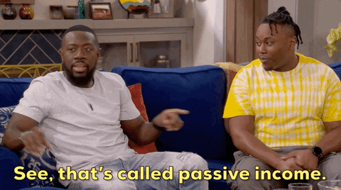

# Data Farming 101

<figure><figcaption></figcaption></figure>

### What is Data Farming?

Data Farming (DF) is Ocean Protocol's **incentive system for curating high quality assets on the Ocean Market.** Participants vote on the Ocean Market assets that they believe are high quality and likely to sell. If they are right, then these Data Farmers **get a portion of the Ocean Market sales of the assets** they voted on!

(If you are familiar with 'liquidity mining', then you will find that Data Farming is similar but tuned instead for the curation of high quality assets on the Ocean Market.)

### What's the difference between Data Farming and Yield Farming?

Unlike yield farming in DeFi, data farming has real intrinsic utility for Ocean Protocol stakeholders: as Data Farmers determine which are the highest quality assets on the Ocean Market to purchase, then the Data Farmers earn active OCEAN rewards when these assets sell. It's this **curation of the "best" assets on the Ocean Market** that shortens the search times for those looking to shop on the Ocean Market. We also put in place an incentive system for Publishers of assets to gain **2x the rewards** in Data Farming, thus driving forward the addition of great assets on the OM.

### Passive and Active Rewards

Every week OCEAN rewards are paid out to Data Farmers in two different ways: **passive** rewards and **active** rewards. The two reward functions produce different variable APYs.&#x20;

#### What are Passive Rewards?

Passive rewards are the OCEAN rewards paid to Data Farmers just for locking their OCEAN tokens.&#x20;

<figure><figcaption></figcaption></figure>

[To start getting passive rewards, go here.](../user-guides/get-veocean-tokens.md)

#### What are Active Rewards?

Active rewards are OCEAN rewards paid to Data Farmers that allocate their veOCEAN tokens to Ocean Market assets. They're called Active rewards because the amount of rewards relies on the active participation of the Data Farmer to select and allocate veOCEAN to these assets. **Active rewards yield depends on the sales of allocated assets.** No sales = no rewards, so choose your favorites wisely & then allocate. Always DYOR.

Active rewards are governed and defined by the [Reward Function](df-background.md#reward-function).

[To start getting active rewards, go here.](../user-guides/how-to-data-farm.md)

#### Splitting the Pie

Each Data Farming weekly round has a pool of OCEAN rewards, and 50% of the pool is paid out in the form of passive rewards & 50% in the form of active rewards.

| Passive Rewards | Active Rewards |
| --------------- | -------------- |
| 50%             | 50%            |

### What are Publisher Rewards?

<figure><figcaption>
Publishing makes you *more* OCEAN rewards
</figcaption></figure>

Data Farming strongly incentivizes publishing assets on the Ocean Market by giving double the active rewards to Data Farmers that allocate to their own published assets.

How is it calculated? _All the veOCEAN a Data Farmer has allocated to an asset they’ve published is **doubled for the rewards calculation.**_

You can read more about the implementation [in this blog post](https://blog.oceanprotocol.com/data-farming-publisher-rewards-f2639525e508).

## [GET STARTED DATA FARMING HERE.](https://df.oceandao.org)

