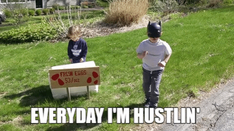
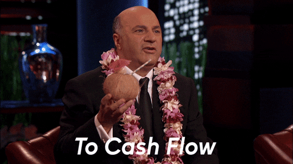

# DF Max Out Yield (Purple Belt)

<figure><figcaption>
You know enough to be dangerous.
</figcaption></figure>

### How to Maximize Your Yield

If you only lock your OCEAN tokens to get passive yield, then you're leaving money on the table. Data Farming rewards farmers that allocate their veOCEAN tokens to assets that **generate revenue** in the Ocean ecosystem. (No revenue, no rewards.) In addition, Data Farming incentivizes **publishing** assets in the Ocean ecosystem too - you get **2x the allocation power** when you allocate to an asset that you publish!

Thus, if you really want to max out your APY:

1. Lock your OCEAN for veOCEAN to claim weekly Passive Rewards
2. Create & publish assets (and make $ in selling them) — or work with people who can
3. Lock OCEAN and stake veOCEAN on your published assets for weekly Active Rewards
4. Claim the rewards

### Those assets don't sell themselves!

Marketing your assets to buyers is your challenge. Just because you publish them in the Ocean ecosystem doesn't mean that they will sell. It will take real work. Your reward is great APY. Its incentives all the way down 🙂

<figure><figcaption></figcaption></figure>

### Measuring Data Farming's Success

**Data Consume Volume (DCV)** is our term for **the total $ amount spent on purchases of Ocean ecosystem assets**, transaction fees, and more. The higher DCV of Ocean ecosystem assets, then the more OCEAN rewards are distributed to Data Farmers. It's that simple!

### How Rewards are Calculated

The Reward Function (RF) governs how active rewards are allocated to Data Farmers.

**Rewards are calculated as follows:**

1. Distribute OCEAN across each asset **based on rank**: highest-DCV asset gets the most OCEAN, etc.
2. For each asset and each veOCEAN holder: If the holder is a publisher, 2x the effective allocation – Baseline rewards = (% allocation in asset) \* (OCEAN for an asset) – Bound rewards to the asset by 125% APY – Bound rewards by asset’s DCV \* 0.1%.

For mathematicians and coders, you can find this code inside [calcrewards.py](https://github.com/oceanprotocol/df-py/blob/main/df\_py/volume/calcrewards.py) in the Ocean Protocol [df-py repo](https://github.com/oceanprotocol/df-py/)!

### What are Ranked Rewards?

In Data Farming Round 23 Ranked Rewards were introduced to smooth out the reward distribution by using a logarithmic function.

**Since rewards are distributed across the Top 100 assets, all data farmers (Publishers & Curators) are now incentivized to support a broader range of assets rather than optimizing on a single asset.**

At the top-end, this helps increase the quality and diversification of inventory.

At the bottom-end, this eliminates some potential free-rider issues and smooths out the reward distribution.

You can read more about the why, what, and how of Ranked Rewards [in this blog post](https://blog.oceanprotocol.com/data-farming-df22-completed-df23-started-reward-function-tuned-ffd4359657ee) and find the full study [in these slides](https://docs.google.com/presentation/d/1HIA2zV8NUPpCELmi2WFwnAbHmFFrcXjNQiCpEqJ2Jdg/).

### Assets that Qualify for Data Farming

Data assets that have veOCEAN allocated towards them get Data Farming active rewards.

The asset may be of any type — dataset, an algorithm for Compute-to-Data, or any other Datatoken token-gated system. The asset may be fixed price or free price. If fixed price, any token of exchange is alright (OCEAN, H2O, USDC, etc).

To qualify for DF, an asset must also:

* Have been created by Ocean Smart contracts [deployed](https://github.com/oceanprotocol/contracts/blob/v4main/addresses/address.json) by OPF to [production networks](../discover/networks/)
* Can’t be in [purgatory](https://github.com/oceanprotocol/list-purgatory/blob/main/policies/README.md)

### A Brief History of Data Farming

Data Farming has evolved over time and will continue to do so as the Emission Curve progresses. Below are the phases and parameters incurred during the evolution of the Data Farming program. We are now in the DF Main phase.

**DF Alpha - Rounds 1-4 (4 wks)**\
10K OCEAN rewards were budgeted per week. Counting started Thu June 16, 2022 and ended July 13, 2022. Rewards were distributed at the end of every week, for the activity of the previous week. It ran for 4 weeks. The aim was to test technology, learn, and onboard data publishers.

**DF/VE Alpha - Rounds 5-8 (4 wks)**\
10K OCEAN rewards were budgeted per week. Counting started Thu Sep 29, 2022 and ended Oct 27, 2022. Rewards were distributed at the end of every week, for the activity of the previous week. It ran for 4 weeks. The aim was to resume Data Farming along with veOCEAN, test the technology, onboard data publishers, and keep learning.

**DF Beta - Rounds 9-28 (20 wks)**\
Up to 100K OCEAN rewards were budgeted per week. Counting started Thu Oct 27, 2022, and ended on March 15, 2023. It ran for 20 weeks. The aim was to test the effect of larger incentives, and support ecosystem participation, while continually refining the underlying technology.

**DF Main - Rounds 29-1000+**\
We are now in DF Main which immediately followed the release of DF Beta on Thu Mar 16, 2023. Rewards begin at 150k per week and go to 1.1M OCEAN per week. DF Main emits 503.4M OCEAN worth of rewards and lasts for decades.&#x20;

The amount of OCEAN released is determined by the emission schedule as defined by the [Emission Curve](df-emissions-apys.md#emissions--first-5-years), and perhaps more easily understood in the Reward Schedule below.

### Reward Schedule

The table below shows the total amount of OCEAN rewards that will be distributed among Passive and Active rewards each week. The table cross-references DF Round Number, Start Date, Phase & Week, Sub-Phase & Week, and OCEAN Rewards/Week.

<figure><figcaption>
<em>Ocean Reward Schedule for the next 20+ years</em>
</figcaption></figure>

<figure><figcaption></figcaption></figure>
