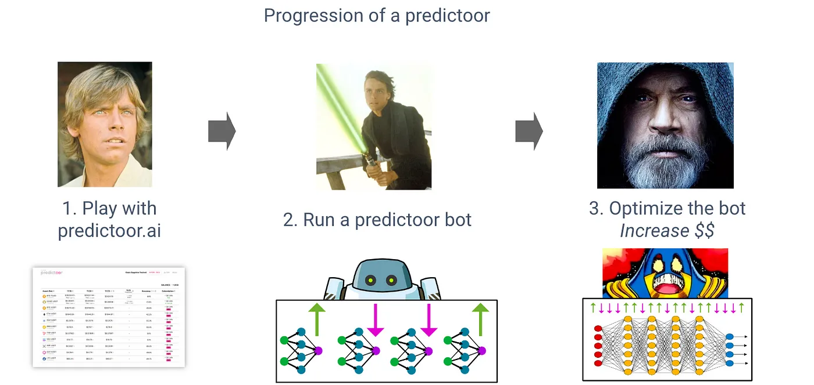

# Run AI-powered prediction bots and earn!

<figure></figure>

## What is a Predictoor?

Predictoors are people running AI-powered prediction bots, which send data feeds into [Ocean Predictoor](/predictoor/pdr-intro.md) that predict whether BTC, ETH etc will rise or fall 5min or 1h into the future. Such feeds are alpha to traders, and a key component of the stack. 

Predictoors earn from sales of the feeds (to traders) and from stake reshuffling ($ going from incorrect predictoors to correct ones).

## What is Predictoor DF?

Predictoor DF is a new incentives program as part of Active Data Farming stream, that amplifies predictoor's earnings, via extra sales to Ocean Predictoor data feeds.

## What are the Rewards for Predictoor DF?
- **37,000 OCEAN/week, every week.**
    - A special “DF buyer” bot purchases Predictoor feeds. It starts operating on Nov 9. Every day, it spends 1/7 of the weekly Predictoor OCEAN budget for another 24h subscription. It spends an equal amount per feed. (Currently there are 20 feeds: 10 x 5min, 10 x 1h.)
    - The OCEAN comes from the Ocean DF budget, as part of the 75,000 OCEAN/week for Active DF. The Volume DF budget has been adjusted to 37,000 OCEAN/week, and Challenge DF to 1,000 OCEAN/week. Here are details.    
- **100,000 ROSE/week for the first 4 weeks.**
    - Payout is at the end of the DF round. Therefore there will be payouts at the end of DF62, DF63, DF64, and DF65. Payout for a given predictoor is pro-rata to the net earnings of that predictoor over that DF round, specifically (total sales $ to the predictoor) minus (predictoor stake slashed due to being wrong).
    - The ROSE comes from a generous contribution of Oasis Protocol Foundation 👪🙏.

## How rewards are distributed to Predictoors?
Rewards are going to be distributed to Predictoors based on their accuracy and stake.

- OCEAN rewards - Rewards are integrated into the system through feed buys, and Predictoors will receive a share of these rewards, just like in the case of [regular purchases](/predictoor/pdr-earn.md).
- ROSE rewards - Payout for a given predictoor is pro-rata to the net earnings of that predictoor over that DF round, specifically (total sales $ to the predictoor) minus (predictoor stake slashed due to being wrong)

## How to claim Predictoor DF rewards?
Claiming comes in two parts: OCEAN and ROSE.

- For OCEAN rewards: as these act as more sales coming to you, you claim your OCEAN from sales in the usual way, by running the OCEAN payout script.
- For ROSE rewards: run the ROSE payout script, linked from here.

## How to become a Predictoor?
Running a bot will automatically make you eligible for Predictoor DF rewards. Therefore, you simply need to become a predictoor! Get started with the help of [this quickstart README](https://github.com/oceanprotocol/pdr-backend/blob/main/READMEs/predictoor.md).
<figure></figure>

