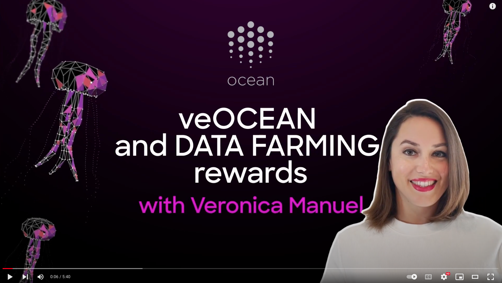
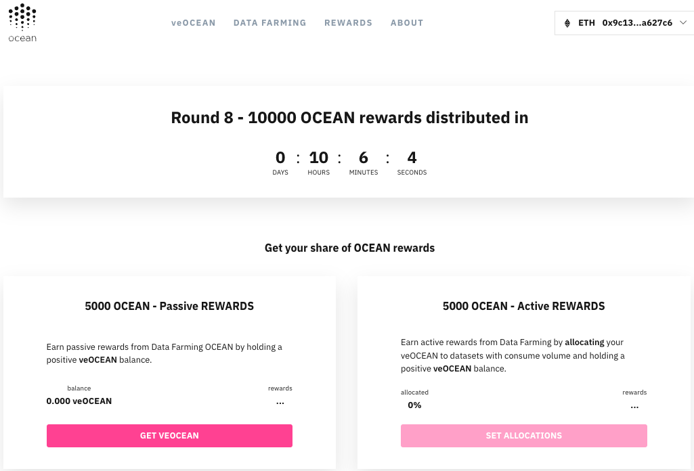
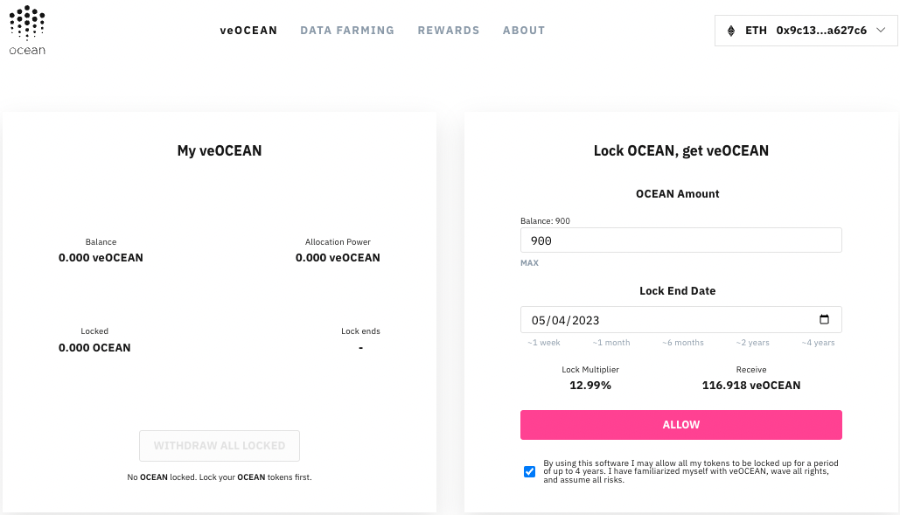
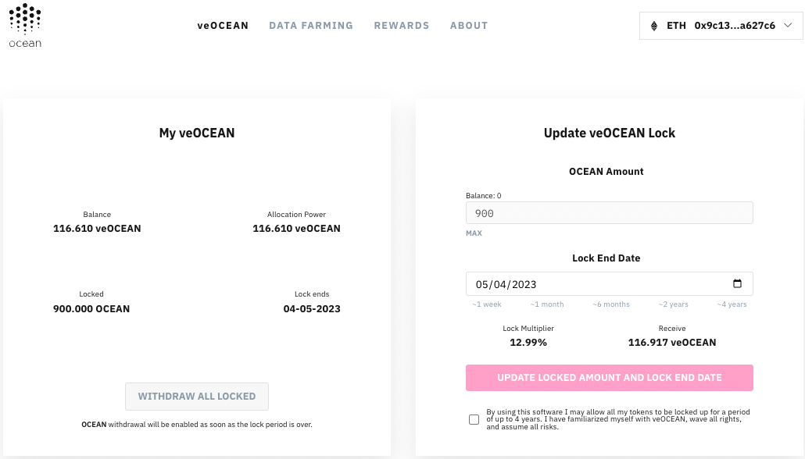
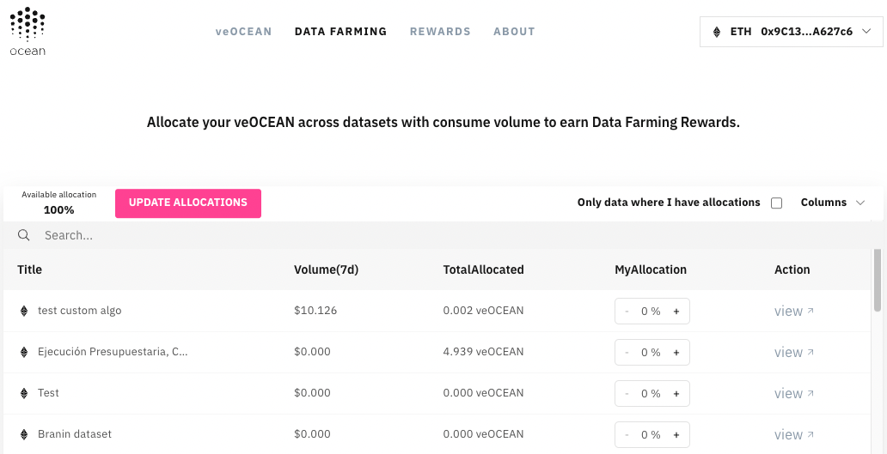
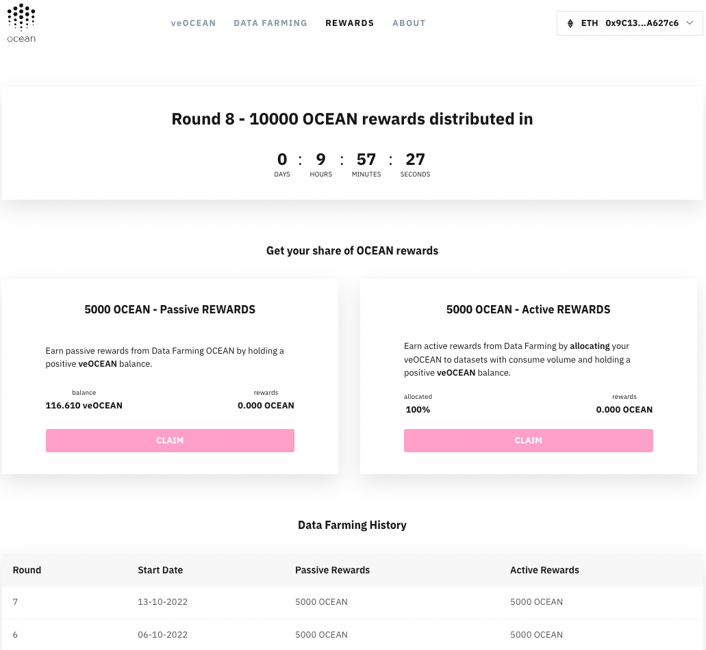
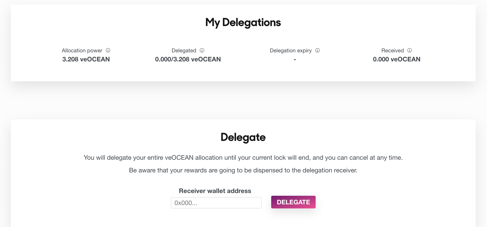

# Tutorial: How To Earn OCEAN Rewards

There are two types of OCEAN rewards: passive and active rewards. OCEAN token holders may generate passive OCEAN rewards by locking up OCEAN in exchange for veOCEAN tokens. veOCEAN tokens can then be allocated to Ocean Market datasets and algorithms to generate active OCEAN rewards.

## How do I get rewards?

To generate rewards, start by navigating to [df.oceandao.org](https://df.oceandao.org). At the top of this page is the weekly round of OCEAN rewards and the quantity of OCEAN rewards to be distributed. The countdown timer shows the time until **each Thursday** when rewards are distributed. OCEAN rewards can be claimed every Thursday on the [Rewards page](https://df.oceandao.org/rewards).

- If you don't have veOCEAN tokens, then click the [Get veOCEAN](https://df.oceandao.org/veocean) button on the Passive Rewards panel on the left side of the page to navigate to the veOCEAN tab.

- If you already have veOCEAN tokens, then on the Active Rewards panel on the right side of the page, click the [Set Allocations](https://df.oceandao.org/data) button to navigate to the Data Farming tab.

## veOCEAN

### Passive Rewards

When a user locks their OCEAN tokens for a finite period of time, they get veOCEAN tokens in return. Based on the quantity of veOCEAN, the user accumulates weekly OCEAN rewards. Because rewards are generated without human intervention, these are called "passive" OCEAN rewards. OCEAN rewards are claimable every Thursday on the [Rewards page](https://df.oceandao.org/rewards).

#### How do I get veOCEAN?

After navigating to the [veOCEAN page](https://df.oceandao.org/veocean), you can generate passive OCEAN rewards by locking OCEAN tokens on the "Lock OCEAN, get veOCEAN" panel on the right side of the page. Connect a wallet to see the balance of OCEAN tokens update above the OCEAN Amount form field. Select a lock end date to see the Lock Multiplier and Receive veOcean fields update.

**The more OCEAN tokens you lock or if you lock them for a longer period of time, then the more rewards you get!**

Click the checkbox below the inactive pink ALLOW button, then click the activated pink ALLOW button. Sign the transaction with your wallet. Then, click the LOCK OCEAN button. Sign the transaction with your wallet. Note that all veOCEAN contracts are deployed on the Ethereum mainnet.

Now the OCEAN tokens are locked in exchange for veOCEAN. The left side panel called "My veOCEAN" shows the corresponding balances of OCEAN and veOCEAN. You can withdraw your OCEAN tokens on this panel when the lock time ends.

**Note that your OCEAN tokens cannot be withdrawn until the Lock End Date!**

Notice the right side panel is now titled "Update veOCEAN Lock". You can add OCEAN tokens to your lock or you can increase the Lock End Date, but you cannot shorten your Lock End Date.

## Data Farming

### Active Rewards

When a user allocates veOCEAN tokens to Ocean Market projects, then weekly OCEAN rewards are given to a user based on the sales of those projects. Since these rewards depend on human intervention to decide the allocations, they are categorized as "active" rewards instead of passive rewards. OCEAN rewards are claimable every Thursday on the [Rewards page](https://df.oceandao.org/rewards).

#### How do I allocate veOCEAN?

You can generate active OCEAN rewards by allocating veOCEAN to various OCEAN Market projects to gain a portion of project sales.

Click on the Data Farming tab at the top of the page to navigate to the [Data Farming page](https://df.oceandao.org/data).

The OCEAN Market datasets and algorithms are listed in the grid. Each column is sortable, and there is a Search field on top of the grid to search for specific projects.

It is recommended to allocate all of your veOCEAN tokens to OCEAN Market projects to generate maximum rewards. When you allocate your veOCEAN to these datasets or algorithms, then you get a portion of those projects's sales. **If you allocate your veOCEAN to a project with many other allocators, then your portion of rewards will become diluted because there are more allocators to reward. You may be interested then in allocating veOCEAN to a project with fewer allocators to generate a greater percentage of rewards. However, if a project does not sell, then no rewards are generated.** Thus, it is important to allocate veOCEAN to projects you believe in, and do your research.

Once you allocate your percentage of veOCEAN to projects using the MyAllocation column, then click on the UPDATE ALLOCATIONS button and sign the transaction with your wallet. Note that as the OCEAN Market projects exist on different networks i.e. Ethereum, Polygon, etc. you can allocate your veOCEAN towards assets that are published on these different networks.

## Claim Rewards

Click on the Rewards tab at the top of the page to come to the [same page](https://test-df.oceandao.org/rewards) as at the beginning of this tutorial. Notice the balance of veOCEAN appears under the Passive Rewards panel on the left and the percentage allocated appears on the Active Rewards panel on the right.

All rewards are paid out in OCEAN tokens. On every Thursday the pink "Claim" buttons on this page become activated, and you can claim your weekly OCEAN rewards directly into your wallet by clicking on these active buttons.

#### Linear Decay

**Your balance of veOCEAN may be less than the amount when you first locked your tokens because your veOCEAN balance decreases linearly over time until the Lock End Date when you can withdraw your OCEAN tokens.** This is because rewards are designed to be paid out weekly in a decreasing amount until you unlock your OCEAN tokens entirely. The veOCEAN code is a fork of Curve's battle tested [veCRV](https://curve.readthedocs.io/dao-vecrv.html) token code.

### Withdrawl

After the Lock End Date, then you can withdraw your principal OCEAN tokens on the [veOCEAN page](https://df.oceandao.org/veocean) on the left side panel.

## Delegation

Delegation allows you to temporarily transfer your veOCEAN allocation power to another wallet address. This feature enables you to earn a higher annual percentage yield (APY) by delegating to an address that efficiently manages your allocation, without the need for reallocation and transaction fees.

If you have multiple wallets, delegation enables you to manage your allocations with just one wallet address.

When you delegate, you transfer 100% of your veOCEAN allocation power for a limited period. After delegation, you cannot manage your allocations until the delegation expires. The delegation expiration date is the same as the veOCEAN lock end date at the time of delegation. If necessary, you can extend your lock before delegating. You can cancel your delegation at any time.

Once delegated, rewards will be sent to the wallet address you delegated to. The delegation receiver is in charge of your rewards and the process of returning those back to you.

Follow these steps to delegate you veOcean:
1. Go to the DF Portal and select the wallet address you wish to delegate to. 
2. Click the Delegate button and sign the transaction. You can view information about your delegation in the My Delegations component. 
3. If needed, you can cancel the delegation to regain your allocation power before the delegation expires.

If you receive veOCEAN allocation power from other wallets, you will receive their rewards and be responsible for distributing rewards to the delegators. You cannot delegate the veOCEAN you received from delegates, only the veOCEAN you received from your lock.

## Learn More

If you would like to find out more details about veOCEAN, Data Farming, and rewards calculations, then please visit the About tab to read a great [blog post](https://blog.oceanprotocol.com/ocean-data-farming-series-c7922f1d0e45) on this topic.
