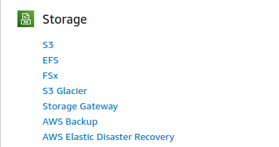
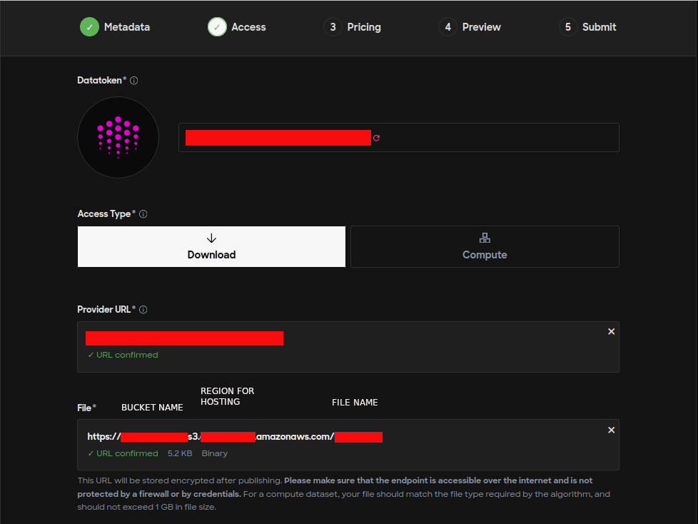

# AWS

### Amazon Web Services

AWS provides various options to host data and multiple configuration possibilities. Publishers are required to do their research and decide what would be the right choice. The below steps provide one of the possible ways to host data using an AWS S3 bucket and publish it on Ocean Marketplace.

**Prerequisite**

Create an account on [AWS](https://aws.amazon.com/s3/). Users might also be asked to provide payment details and billing addresses that are out of this tutorial's scope.

**Step 1 - Create a storage account**

**Go to AWS portal**

Go to the AWS portal for S3: https://aws.amazon.com/s3/ and select from the upper right corner `Create an AWS account` as shown below.


**Fill in the details**


**Create a bucket**

After logging into the new account, search for the available services and select `S3` type of storage.



To create an S3 bucket, choose `Create bucket`.


Fill in the form with the necessary information. Then, the bucket is up & running.


**Step 2 - Upload asset on S3 bucket**

Now, the asset can be uploaded by selecting the bucket name and choosing `Upload` in the `Objects` tab.


**Add files to the bucket**

Get the files and add them to the bucket.

The file is an example used in multiple Ocean repositories, and it can be found [here](https://raw.githubusercontent.com/oceanprotocol/c2d-examples/main/branin\_and\_gpr/branin.arff).


The permissions and properties can be set afterward, for the moment keep them as default.

After selecting `Upload`, make sure that the status is `Succeeded`.


**Step 3 - Access the Object URL on S3 Bucket**

By default, the permissions of accessing the file from the S3 bucket are set to private. To publish an asset on the market, the S3 URL needs to be public. This step shows how to set up access control policies to grant permissions to others.

**Editing permissions**

Go to the `Permissions` tab and select `Edit` and then uncheck `Block all public access` boxes to give everyone read access to the object and click `Save`.

If editing the permissions is unavailable, modify the `Object Ownership` by enabling the ACLs as shown below.


**Modifying bucket policy**

To have the bucket granted public access, its policy needs to be modified likewise.

Note that the `<BUCKET-NAME>` must be chosen from the personal buckets dashboard.

```json
{
  "Version": "2012-10-17",
  "Statement": [
    {
      "Sid": "Public S3 Bucket",
      "Principal": "*",
      "Effect": "Allow",
      "Action": "s3:GetObject",
      "Resource": "arn:aws:s3:::<BUCKET-NAME>/*"
    }
  ]
}
```

After saving the changes, the bucket should appear as `Public` access.


**Verify the object URL on public access**

Select the file from the bucket that needs verification and select `Open`. Now download the file on your system.


**Step 4 - Get the S3 Bucket Link & Publish Asset on Market**

Now that the S3 endpoint has public access, the asset will be hosted successfully.

Go to [Ocean Market](https://market.oceanprotocol.com/publish/1) to complete the form for asset creation.

Copy the `Object URL` that can be found at `Object Overview` from the AWS S3 bucket and paste it into the `File` field from the form found at [step 2](https://market.oceanprotocol.com/publish/2) as it is illustrated below.



####
