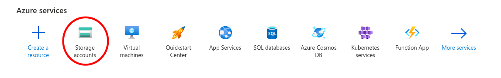
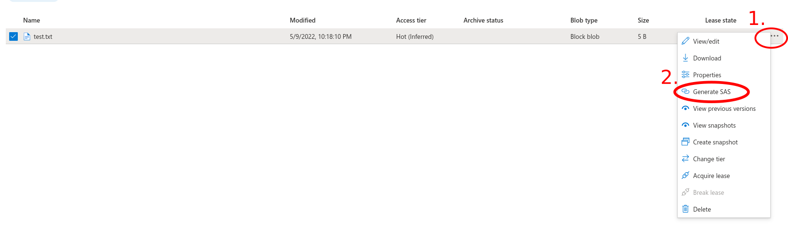
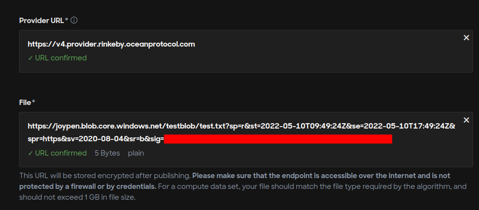

# Azure Cloud

### Microsoft Azure

Azure provides various options to host data and multiple configuration possibilities. Publishers are required to do their research and decide what would be the right choice. The below steps provide one of the possible ways to host data using Azure storage and publish it on Ocean Marketplace.

**Prerequisite**

Create an account on [Azure](https://azure.microsoft.com/en-us/). Users might also be asked to provide payment details and billing addresses that are out of this tutorial's scope.

**Step 1 - Create a storage account**

**Go to Azure portal**

Go to the Azure portal: https://portal.azure.com/#home and select `Storage accounts` as shown below.

**Create a new storage account**

.png>)

**Fill in the details**

**Storage account created**

.png>)

**Step 2 - Create a blob container**

.png>)

**Step 3 - Upload a file**

.png>)

**Step 4 - Share the file**

**Select the file to be published and click Generate SAS**

**Configure the SAS details and click `Generate SAS token and URL`**

.png>)

**Copy the generated link**

.png>)

**Step 5 - Publish the asset using the generated link**

Now, copy and paste the link into the Publish page in the Ocean Marketplace.

