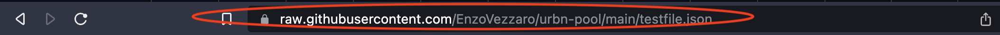

# Github

### **Github**

GitHub can be used to host and share files. This allows you to easily share and collaborate on files, track changes using commits, and keep a history of updates. GitHub's hosting capabilities enable you make your content accessible on the web.

### **Prerequisites**

Create an account on [Github](https://github.com/). Users might also be asked to provide details and billing addresses that are outside of this tutorial's scope.

**Step 1 - Create a new repository on GitHub or navigate to an existing repository where you want to host your files.**

<figure><figcaption>
Create new repository
</figcaption></figure>

Fill in the repository details. **Make sure your Repo is public.**

<figure><figcaption>
Make the repository public
</figcaption></figure>

### Host Your File

**Step 2 - Upload a file**

Go to your repo in Github and above the list of files, select the Add file dropdown menu and click Upload files. Alternatively, you can use version control to push your file to the repo.

<figure><figcaption>
Upload file on Github
</figcaption></figure>

To select the files you want to upload, drag and drop the file or folder, or click 'choose your files'.

<figure><figcaption>
Drag and drop new files on your GitHub repo
</figcaption></figure>

In the "Commit message" field, type a short, meaningful commit message that describes the change you made.

<figure><figcaption>
Commit changes
</figcaption></figure>

Below the commit message field, decide whether to add your commit to the current branch or to a new branch. If your current branch is the default branch, then you should choose to create a new branch for your commit and then create a pull request.

After you make your commit (and merge your pull request, if applicable), then click on the file.

<figure><figcaption>
Upload successful
</figcaption></figure>

**Step 3 - Get the RAW version of your file**

To use your file on the Market **you need to use the raw url of the asset**. Also, make sure your Repo is publicly accessible to allow the market to use that file.&#x20;

Open the File and click on the "Raw" button on the right side of the page.

<figure><figcaption>
Click the Raw button
</figcaption></figure>

Copy the link in your browser's URL - it should begin with "https://raw.githubusercontent.com/...." like in the image below.

<figure><figcaption>
Grab the RAW github URL from your browser's URL bar
</figcaption></figure>

<figure><figcaption>
Copy paste the raw url
</figcaption></figure>

**Step 4 - Publish the asset using the Raw link**

Now, copy and paste the Raw Github URL into the File field of the Access page in the Ocean Market.

<figure><figcaption>
Upload on the Ocean Market
</figcaption></figure>

Et voilà! You have now successfully hosted your asset on Github and properly linked it on the Ocean Market.

