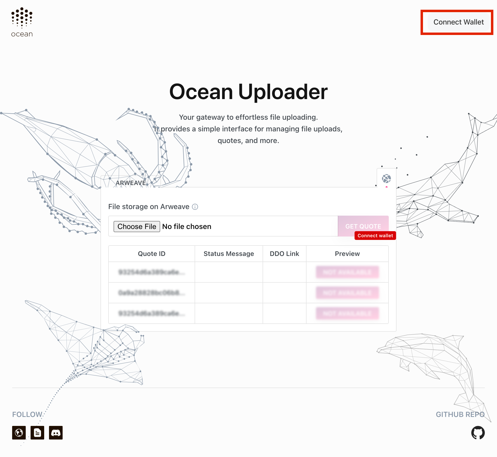
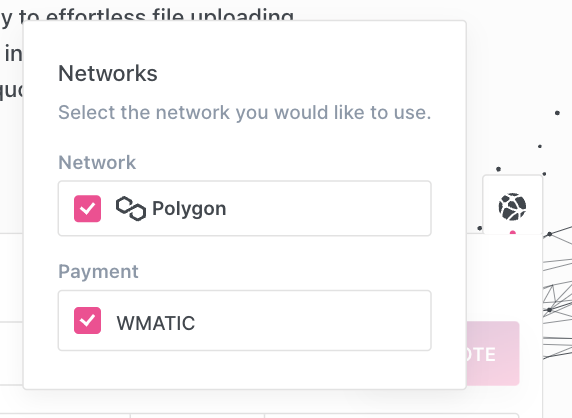
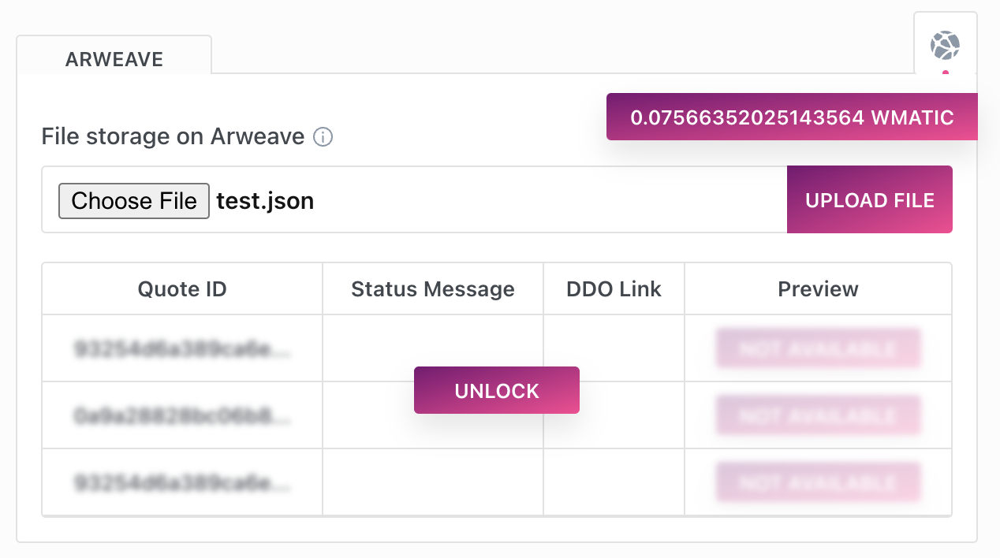
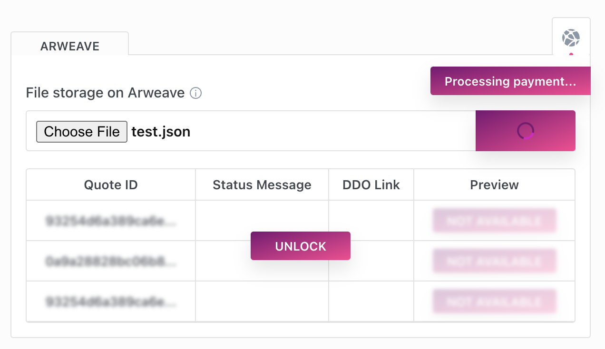
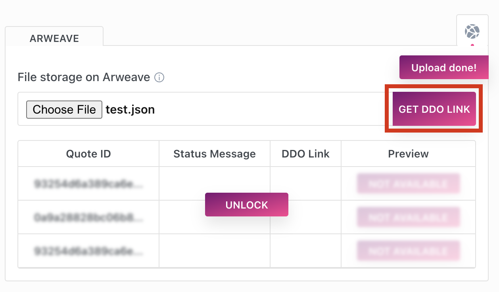
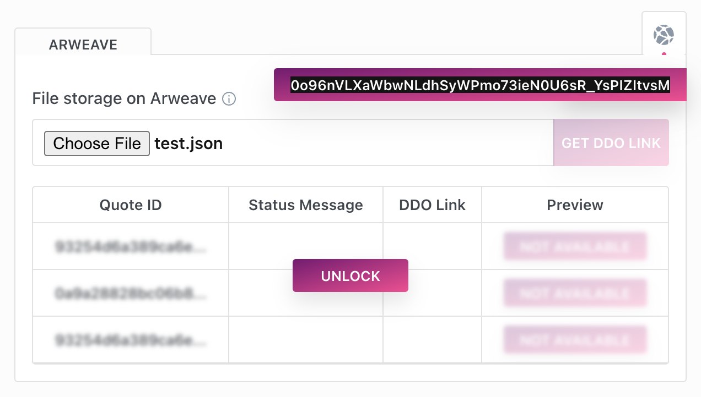

# Ocean Uploader

### What is Ocean Uploader? 

Uploader is designed to simplify the process of storring your assets on decentralized networks (such as arweave and filecoin). It provides access to multiple secure, reliable, and cost-effective storage solutions in an easy to use UI and javascript library.

### What decentralized storage options are available?

Currently we support Arweave and we will soon be releasing Filecoin support. In the future we will also support multiple other options. 

### How to store an asset on Arweave with the Uploader UI? 

Ready to dive into the world of decentralized storage with Uploader? Let's get started:

1. Wallet Check: First things first, let's make sure you've got some of that shiny polygon MATIC and WMATIC in your wallet. If you're coming up short, no worries! You can wrap your MATIC directly through the app.

2. Is your wallet ready? Let's head over to the [Uploader UI](https://uploader.oceanprotocol.com/).

3. Now, give that 'Connect Wallet' button a click. This is just so Uploader knows which wallet we're working with.



4. By the way, ensure you're on the Polygon network.



5. See that 'Choose file' button? Give it a click and select the awesome file you're looking to upload.

6. Wondering how much the storage will cost? Now, hit 'Get Quote'. This will let you know the estimated cost of storing your file. 


7. You're ready to go - click 'Upload file'.



8. You'll now see the first Metamask pop-up - here's where you set your spending cap and sign off on the approval transaction. This allows the Uploader to move your WMATIC from your wallet in order to pay for the storage.

9. One more Metamask pop-up - sign the message that pops up.

10. A Little patience is now required, grab a coffee, or maybe do a little dance 🕺, because the upload might take a few minutes.



11. Almost There: once the upload is complete, click on 'Get DDO link'.



12. Last Metamask pop-up (promise!): Sign one more message to access the transaction ID.

13. Woohoo 🎉 You did it! You now have an Arweave transaction ID for your asset. Pop on over to arweave.net/{YOUR_TXID} to admire your handiwork, you'll be able to access your file at that link. You can use that link to now go and publish your asset on Ocean Market. 



### How to store an asset on Arweave with the Uploader

Install the library using npm or yarn:

```bash
npm install @oceanprotocol/uploader

```bash
yarn add @oceanprotocol/uploader
```

or

```bash
yarn add @oceanprotocol/uploader
```

```typescript
import { ethers } from 'ethers';
import {
  UploaderClient,
  GetQuoteArgs,
  GetQuoteResult
} from '@oceanprotocol/uploader';
import dotenv from 'dotenv';

dotenv.config();

// Set up a new instance of the Uploader client
const signer = new ethers.Wallet(process.env.PRIVATE_KEY);
const client = new UploaderClient(process.env.UPLOADER_URL, process.env.UPLOADER_ACCOUNT, signer);

async function uploadAsset() {
  // Get storage info
  const info = await client.getStorageInfo();

  // Fetch a quote using the local file path
  const quoteArgs: GetQuoteArgs = {
    type: info[0].type,
    duration: 4353545453,
    payment: {
      chainId: info[0].payment[0].chainId,
      tokenAddress: info[0].payment[0].acceptedTokens[0].value
    },
    userAddress: process.env.USER_ADDRESS,
    filePath: ['/home/username/ocean/test1.txt']  // example file path
  };
  const quoteResult: GetQuoteResult = await client.getQuote(quoteArgs);

  // Upload the file using the returned quote
  await client.upload(quoteResult.quoteId, quoteArgs.filePath);
  console.log('Files uploaded successfully.');
}

uploadAsset().catch(console.error);

```