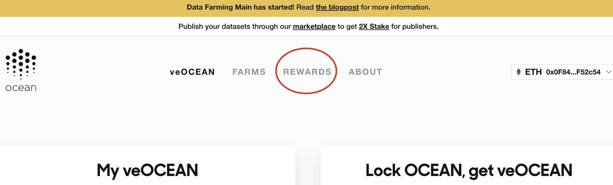

# Claim Rewards Data Farming

<figure><figcaption></figcaption></figure>

Ocean Protocol's Data Farming dapp dispenses rewards **every Thursday** to its participants. 💰 To claim your OCEAN token rewards for data farming, simply navigate to the Data Farming [Rewards page](https://df.oceandao.org/activerewards) and click the Claim OCEAN rewards buttons that will appear pink and clickable each Thursday. Yeehaw!

Want to begin [data farming](https://df.oceandao.org)? Start [here](get-veocean-tokens.md). 🤠

### Step 1 - Navigate to the Data Farming Rewards page

Go to [https://df.oceandao.org/](https://df.oceandao.org), and click the Rewards [link](https://df.oceandao.org/activerewards) at the top of the page.

<figure><figcaption>
Click the Rewards link at the top of the page
</figcaption></figure>

### Step 2 - Click the pink 'Claim # OCEAN' buttons 🛎️

At the bottom of the 'Passive Rewards' and 'Active Rewards' panels are the 'Claim # OCEAN' buttons that appear pink and clickable on Thursdays.

This is where you click to claim your rewards! Easy peasy. You will need to approve the transactions with your wallet.

<figure><figcaption>
Click the pink Claim # Ocean buttons
</figcaption></figure>

### FIRST TIME CLAIMING?

You will need to wait at least one week, but not more than two weeks to claim your rewards for the first time. Check back on Thursday!

### FORGOT TO CLAIM?

If you forget to claim your OCEAN rewards, then do not worry because they continue to accumulate! You can claim them anytime after Thursday. 😃
