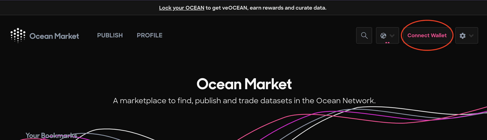
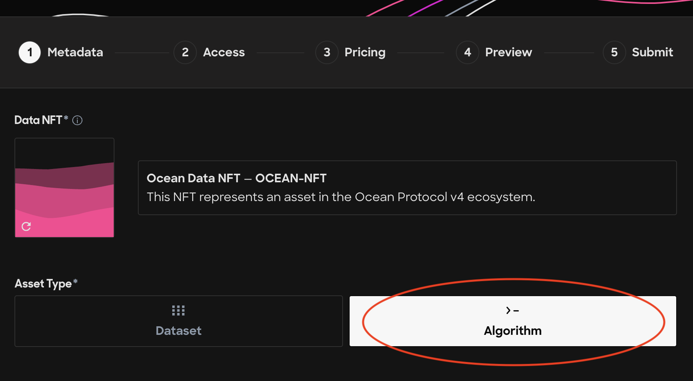
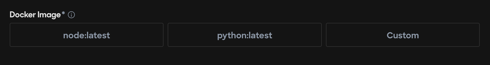
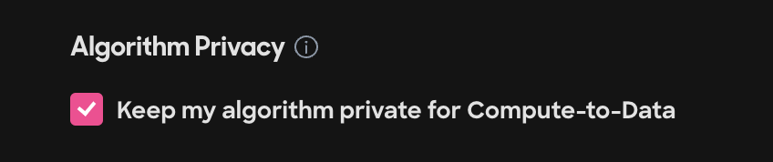
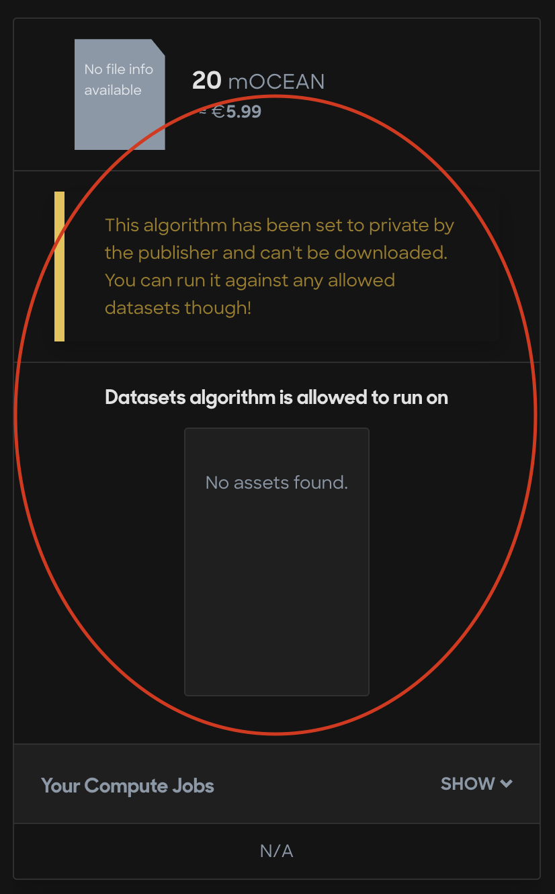

# Publish a C2D Algorithm NFT


You're an algorithm guru after all!


### Publish Your Algorithm NFT

#### Step 1 - Navigate to the Ocean Market

* Go to [https://market.oceanprotocol.com](https://market.oceanprotocol.com)

#### Step 2 - Connect your wallet

* Click the top right Connect Wallet button to connect your self-custody wallet to the Ocean Market

<figure><figcaption>
Connect your self-custody wallet
</figcaption></figure>

#### Step 3 - Click the Publish link in the top left corner of the page

* Click the Publish link

<figure><figcaption>
Navigate to the Publish page
</figcaption></figure>

#### Step 4 - Enter the metadata

* Enter the metadata for your algorithm NFT paying special attention to select the Algorithm asset type button:

<figure><figcaption>
Be sure to select the Algorithm asset type
</figcaption></figure>

* Select the appropriate Docker image to run your code - most algorithms are written in Javascript or Python, so you can use either of these Docker images or your own custom image!

<figure><figcaption>
Select the appropriate Docker image for your algorithm type
</figcaption></figure>

#### Step 5 - Enter the Access information

* Make sure to keep this option checked! ✅

<figure><figcaption>
Keep this option checked for Compute-to-Data
</figcaption></figure>

#### Step 6 - Set a price, Fixed or Free, for your algorithm

* It is recommended that you set a fixed price since the price that you choose for your algorithm will be charged any time that someone selects to run your algorithm on a dataset, including datasets that aren't yours!

<figure><figcaption>
Set a price for your C2D algorithm NFT
</figcaption></figure>

#### Step 7 - Approve the preview

* Your preview should look like the following:

<figure><figcaption></figcaption></figure>

#### Step 8 - Submit the transactions

* Click the pink Submit button at the bottom of the page and sign the two transactions with your wallet. You'll have to pay for gas when you sign to publish your algorithm asset.

<figure><figcaption>
Sign and pay gas for 2 transactions on the final publishing step
</figcaption></figure>

#### Congratulations on publishing your algorithm!&#x20;

* On to the next step -> [Publish a C2D Data NFT](publish-a-c2d-data-nft.md)
