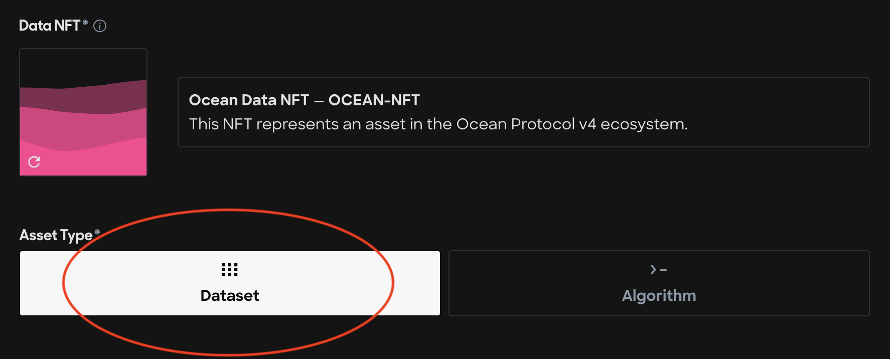
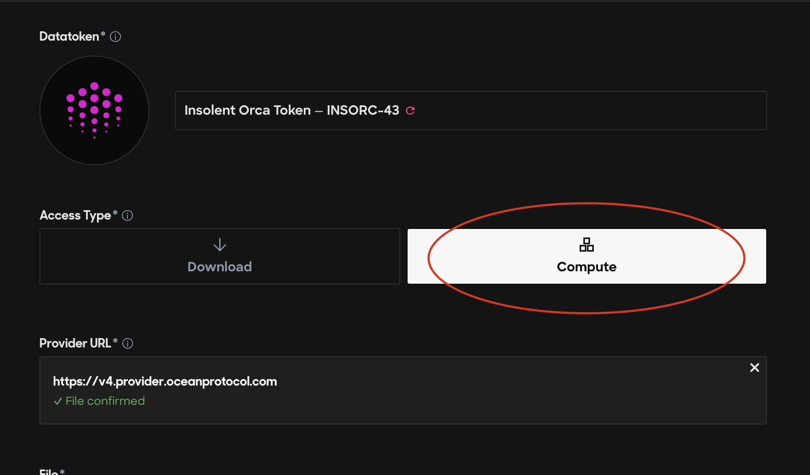
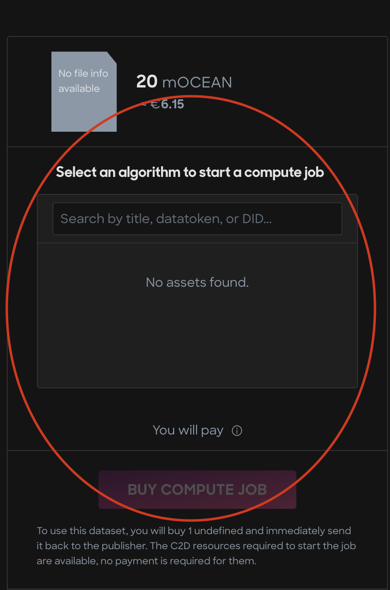
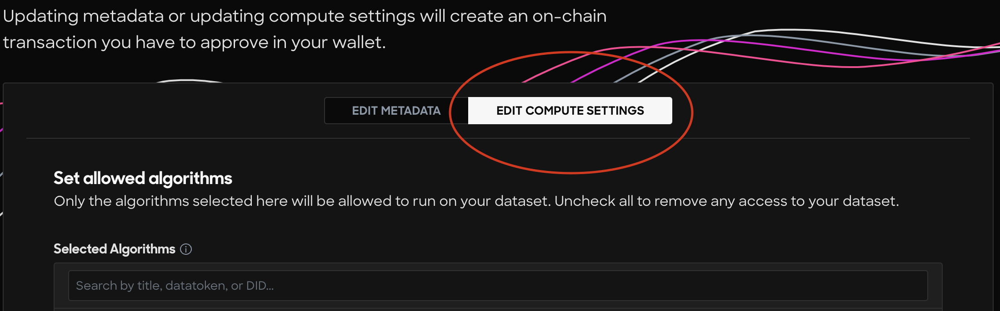
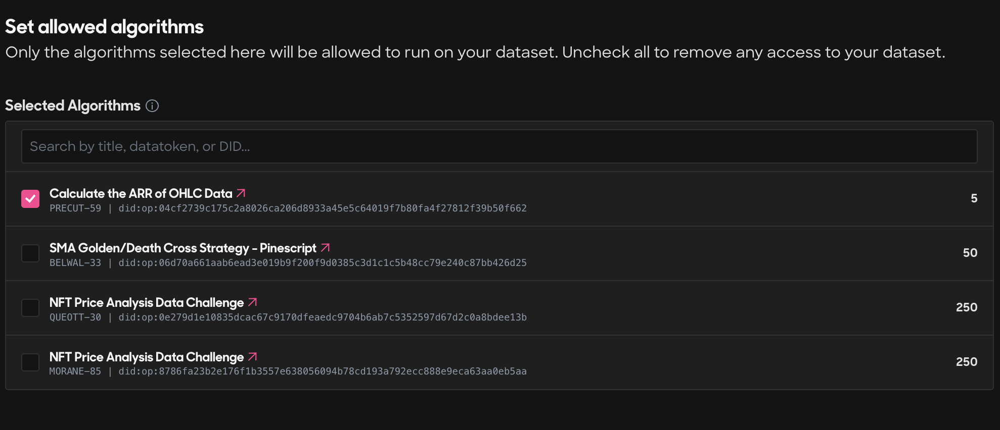
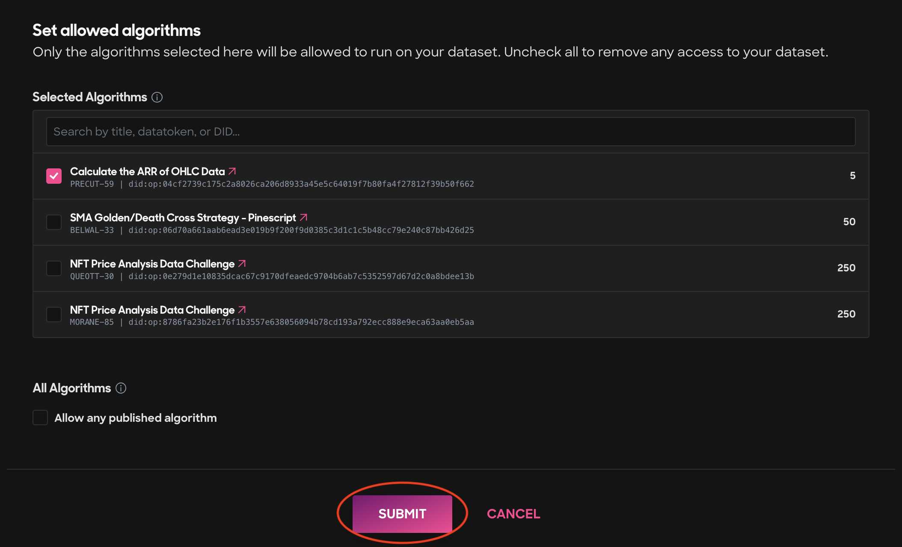

# Publish a C2D Data NFT

<figure><figcaption></figcaption></figure>

#### Step 1 - Navigate to the Ocean Market

* Go to [https://market.oceanprotocol.com](https://market.oceanprotocol.com)

#### Step 2 - Connect your wallet

* Click the top right Connect Wallet button to connect your self-custody wallet to the Ocean Market

<figure><figcaption>
Connect your self-custody wallet
</figcaption></figure>

#### Step 3 - Click the Publish link in the top left corner of the page

* Click the Publish link

<figure><figcaption>
Navigate to the Publish page
</figcaption></figure>

#### Step 4 - Enter the metadata

* Enter the metadata for your data NFT keeping the Dataset asset type selected by default:

<figure><figcaption>
Keep the default Dataset Asset Type selected
</figcaption></figure>

#### Step 5 - Enter the Access information

* You must select the Compute access type in this step!

<figure><figcaption>
Make sure that you select Compute access type
</figcaption></figure>

#### Step 6 - Set a price, Fixed or Free, for your dataset

* Toggle the tab to decide whether you want to set a fixed or free price for your dataset.

<figure><figcaption>
Set a price for your C2D data NFT
</figcaption></figure>

#### Step 7 - Approve the preview

* Your preview should look like the following (this will change soon!):

<figure><figcaption></figcaption></figure>

#### Step 8 - Submit the transactions

* Click the pink Submit button at the bottom of the page and sign the two transactions with your wallet. You'll have to pay for gas when you sign to publish your algorithm asset.

<figure><figcaption>
Sign and pay gas for 2 transactions on the final publishing step
</figcaption></figure>

**Ok, you've published a Data NFT that is \*almost\* ready for Compute-to-Data. Just a few tiny steps left and you're done!**

#### Step 9 - Edit the asset (yes, again!)

* On the webpage for your Data NFT, you need to click the Edit Asset link to change the C2D settings.

<figure><figcaption>
Click the Edit Asset link
</figcaption></figure>

#### Step 10 - Edit the Compute settings

* You must select the Edit Compute Settings button to add your algorithm to the data NFT for computation.

<figure><figcaption>
Select the Edit Compute Settings tab button
</figcaption></figure>

* Then, search for your algorithm in the Selected algorithms search bar and check the box next to it to add it as an algorithm able to compute on the dataset.

<figure><figcaption>
Search for and select your algorithm to compute on your dataset
</figcaption></figure>

#### Step 11 - Submit the transactions

* Click the pink Submit button at the bottom of the page and sign all the transactions.

<figure><figcaption>
Click the Submit button to finalize the transaction
</figcaption></figure>

#### Congratulations! You have fully finished the C2D flow. Check your work by verifying that your algorithm appears on the data NFT's page, like in the following example:

<figure><figcaption>
Your algorithm should appear now on the data NFT's page!
</figcaption></figure>

If you would like to run the compute job, then simply click the radio button to the left of the algorithm's name and click Buy Compute Job.

<figure><figcaption>
Buy the compute job to check your work!
</figcaption></figure>

The output of your algorithm's computation on the dataset will appear in the Algorithm.log output. Voilá!

#### Now do a little dance, because you're done!


