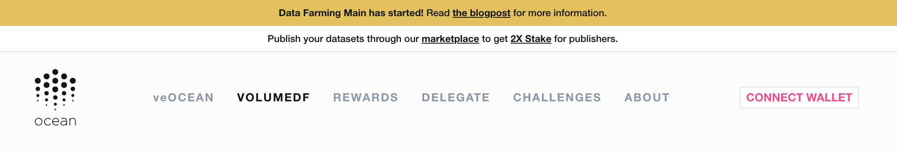
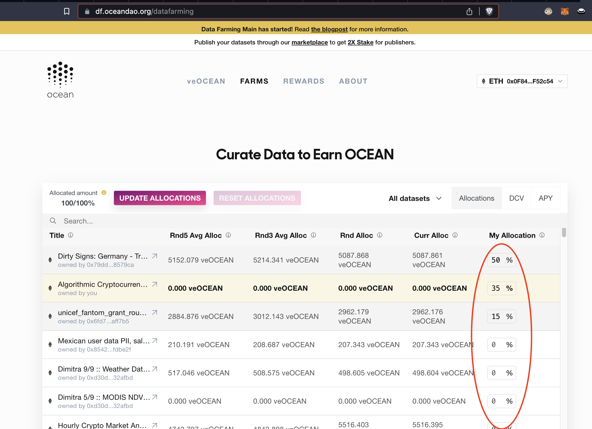
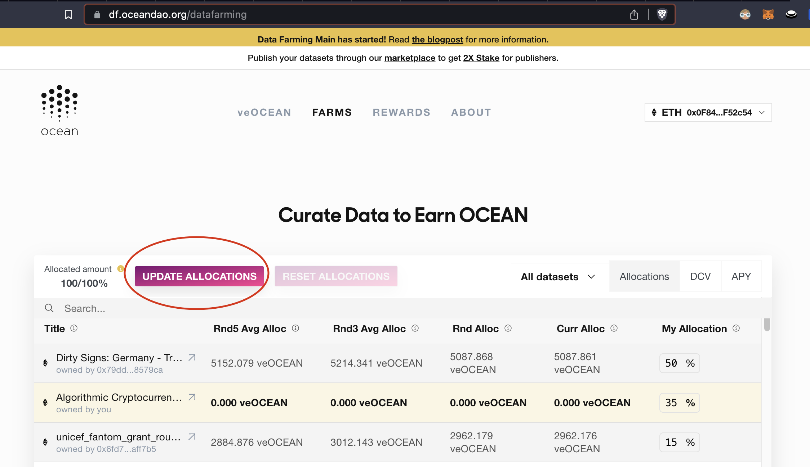

# Harvest More Yield in Volume DF

<figure><figcaption></figcaption></figure>

## Get More Rewards from Volume DF

The bread and butter of the Data Farming dApp is incentivizing OCEAN rewards for curating and publishing valuable assets in the Ocean ecosystem. 

The way that users curate assets is by **pointing their Allocation Power** to them using the Data Farming dApp. We'll show you how!

#### Step 1 - Navigate to the Data Farming dApp

- Go to https://df.oceandao.org

#### Step 2 - Connect your wallet

- Connect your wallet to the Data Farming dApp using the Ethereum network (mainnet)

#### Step 3 - Click on the VolumeDF tab in the top menu

<figure><figcaption>
Click the VolumeDF page link in the menu
</figcaption></figure>

#### Step 4 - Select the assets which you would like to allocate to by toggling the percentage allocation at the end of the row

- On the rightmost column, toggle the percentage of your total Allocation Power that you wish to allocate to each asset of your choice. You will **get a portion of the sales** of each asset that you allocate to!
- Note that if you allocate to an asset that YOU published, then you will get an **effective 2x allocation boost**. The rows for assets that you publish will appear cream-colored.

<figure><figcaption>
Toggle the percentage of your veOCEAN that you would like to allocate to each asset
</figcaption></figure>

#### Step 5 - Click the Update Allocations button

- Click the pink Update Allocations button
- Sign the transactions with your wallet & pay the gas fees

<figure><figcaption>
Click the Update Allocations button
</figcaption></figure>

That's it! You've successfully allocated (aka "voted on") your favorite assets in the Ocean ecosystem using your veOCEAN tokens and are generating active rewards yield. Now, just wait until next Thursday to see if you can [claim any OCEAN rewards](how-to-claim-rewards.md) on the Active Rewards section of the [Rewards page](https://df.oceandao.org/rewards) for your portion of the assets' sales. Remember that your first time claiming rewards will require at least one week, but not more than 2 weeks of wait!