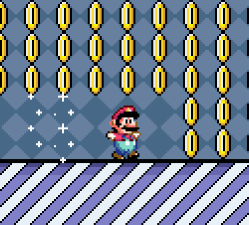

# Get Started Data Farming

<figure><figcaption>
Get veOCEAN tokens
</figcaption></figure>

### What is veOCEAN? 🌊

veOCEAN is a 'voting escrowed' token used in Ocean Protocol's Data Farming dapp to **generate passive and active OCEAN token rewards**. [Data Farming](https://df.oceandao.org) is our dApp to incentivize the publishing and curation of high quality assets on the [Ocean Market](https://market.oceanprotocol.com). Are you curious to learn more about Data Farming or you're a visual learner? Check out our video tutorial below!



### How to Get veOCEAN

#### **Step 1 - Get OCEAN tokens**

* Acquire $OCEAN via a decentralized exchange (DEX) such as Uniswap or a centralized exchange (CEX) such as Binance, Coinbase, etc.

#### **Step 2 - Send to your self-custody wallet**

* Send your OCEAN tokens to a self-custody wallet of yours that supports ERC-20 tokens, like Metamask for example.

#### **Step 3 - Go to Ocean Protocol's Data Farming dapp**

* Go to [https://df.oceandao.org/](https://df.oceandao.org/)

#### Step 4 - Connect Your Wallet + Lock your OCEAN for veOCEAN

* Click on the purple circles in our interactive demo to walk through the steps for locking your OCEAN tokens for veOCEAN tokens.

\{% @arcade/embed flowId="FUSkygksSRsJHwle1zFs" url="https://app.arcade.software/share/FUSkygksSRsJHwle1zFs" %\}

In this step you will:

* Enter the amount of OCEAN tokens that you are going to lock up
* Select a Lock End Date indicating how many weeks you’re going to lock up your OCEAN tokens. (As the Lock End Date goes farther into the future, your Lock Multiplier increases).
* Click on the checkbox to agree to the disclaimer.
* Click the pink “Approve # OCEAN” button
* Accept the transaction in your wallet.
* Click the “Create Lock” button.
* Accept the transaction in your wallet.

Congratulations! You have now locked your OCEAN tokens for veOCEAN tokens.
