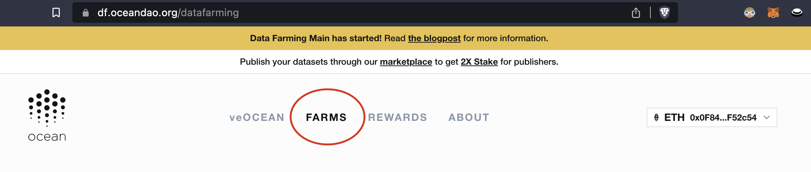

# Harvest More Yield Data Farming

<figure><figcaption></figcaption></figure>

### Get More Yield from Active Rewards

The bread and butter of the Data Farming dApp is incentivizing OCEAN rewards for curating valuable assets on the Ocean Market. The way that users curate assets is by **allocating veOCEAN** to them using the Data Farming dApp. We'll show you how!

#### Step 1 - Navigate to the Data Farming dApp

* Go to https://df.oceandao.org

#### Step 2 - Connect your wallet

* Connect your wallet to the Data Farming dApp using the Ethereum network (mainnet)

#### Step 3 - Click on the Farms tab in the top menu

<figure><figcaption>
Click the Farms page link in the menu
</figcaption></figure>

#### Step 4 - Select the assets on the Ocean Market which you would like to allocate to by toggling the percentage allocation at the end of the row

* On the rightmost column, toggle the percentage of your total veOCEAN that you wish to allocate to each asset of your choice. You will **get a portion of the sales** of each asset that you allocate to!
* Note that if you allocate to an asset which YOU published, then you will **get 2x the rewards** of any sales. The rows for assets that you publish will appear cream colored.

<figure><figcaption>
Toggle the percentage of your veOCEAN that you would like to allocate to each asset
</figcaption></figure>

#### Step 5 - Click the Update Allocations button

* Click the pink Update Allocations button
* Sign the transactions with your wallet & pay the gas fees

<figure><figcaption>
Click the Update Allocations button
</figcaption></figure>

That's it! You've successfully allocated (aka "voted on") your favorite assets on the Ocean Market using your veOCEAN tokens and are generating active rewards yield. Now, just wait until next Thursday to see if you can [claim any OCEAN rewards](claim-ocean-rewards.md) on the Active Rewards section of the [Rewards page](https://df.oceandao.org/rewards) for your portion of the assets' sales. Remember that your first time claiming rewards will require at least one week, but not more than 2 weeks of wait!

### How to Delegate Your Active Rewards

Delegation allows you to temporarily transfer your veOCEAN allocation power to another wallet address. This feature enables you to earn a higher annual percentage yield (APY) by delegating to an address that efficiently manages your allocation, without the need for reallocation and transaction fees.If you have multiple wallets, delegation enables you to manage your allocations with just one wallet address.When you delegate, you transfer 100% of your veOCEAN allocation power for a limited period. After delegation, you cannot manage your allocations until the delegation expires. The delegation expiration date is the same as the veOCEAN lock end date at the time of delegation. If necessary, you can extend your lock before delegating. You can cancel your delegation at any time.Once delegated, rewards will be sent to the wallet address you delegated to. The delegation receiver is in charge of your rewards and the process of returning those back to you.Follow these steps to delegate you veOcean:

1. 1.Go to the DF Portal and enter or copy the wallet address you wish to delegate to into the 'Receiver wallet address' field.
2. 2.Click the Delegate button and sign the transaction. You can view information about your delegation in the My Delegations component.
3. 3.If needed, you can cancel the delegation to regain your allocation power before the delegation expires.

If you receive veOCEAN allocation power from other wallets, you will receive their rewards and be responsible for distributing rewards to the delegators. You cannot delegate the veOCEAN you received from delegates, only the veOCEAN you received from your lock.

<figure><figcaption></figcaption></figure>
