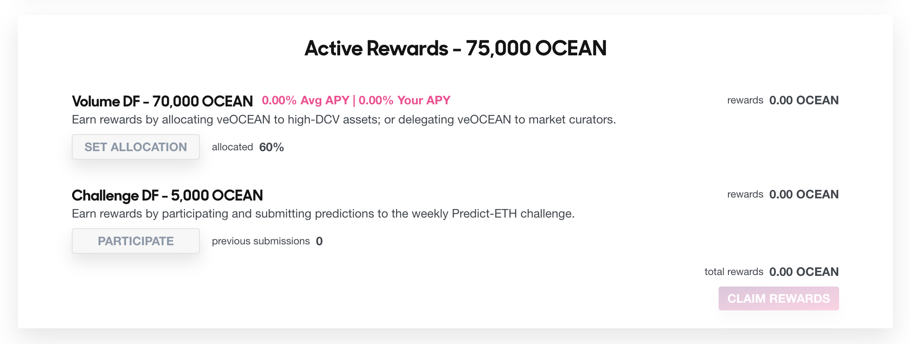

# Harvest More Yield Data Farming - Challenge DF

<figure><figcaption></figcaption></figure>

## Get More Yield from Challenge DF Rewards

The core focus of the Data Farming dApp lies in incentivizing OCEAN rewards for the curation and publication of valuable assets within the Ocean ecosystem. If you're eager to begin extracting value from data but aren't sure how to get started, the Challenge DF is here to help! By participating in data challenges, you can become familiar with the Ocean Protocol stack and discover how to compete effectively.

These are the steps to get involved:

#### Step 1 - Navigate to the Data Farming dApp

- Go to https://df.oceandao.org

#### Step 2 - Click on the Challenges tab in the top menu

<figure><figcaption>
Click the Challenges page link in the menu
</figcaption></figure>

#### Step 3 - Click on the participate button to get to the readme that contains the challenge details.

- You can see the ongoing challenge right away together with some key informations such as submission deadline and available rewards.

<figure><figcaption>
Click the Participate button
</figcaption></figure>

#### Step 4 - Go trought the readme and follow the steps for getting your challenge submitted.

- Click the pink Update Allocations button
- Sign the transactions with your wallet & pay the gas fees

#### Step 5 - Check out the challenge results and see If you are one of the winners.

<figure></figure>
- Connect your wallet to the Data Farming dApp using the Ethereum network (mainnet)

#### Step 6 - View and claim rewards.

<figure><figcaption>
Click the Claim Rewards button
</figcaption></figure>

- Connect your wallet first.
- Your Challenge rewards will be displayed in the rewards metric of the Challenge DF substream section. They will also be combined with other active rewards and shown in the total rewards section.
- To claim your Challenge DF rewards along with other active rewards, simply click on the "Claim Rewards" button in the Active Rewards section.
