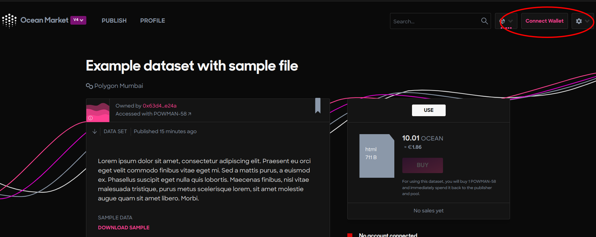

# Buy NFT Assets

<figure><figcaption>
That moment when you buy your first datatoken
</figcaption></figure>

### Let's Go Shopping! 💁‍♀️🛍️

1. Go to the [Ocean Market](https://v4.market.oceanprotocol.com/).
2. Search for NFTs using the search bar in the top right corner of the page. The Ocean Marketplace provides features to search for Data/Algorithm NFTs by text, and users can also sort the result by published date.
3. Connect your wallet. If you know the network the asset is hosted on, then you can also select the network from the dropdown to the left of the Connect Wallet button to filter!

### Steps to Download

#### Step 1 - Buy the asset 🫰

The Buy button is enabled only if the connected wallet address has enough OCEAN tokens to purchase the asset.

Are you buying an asset on the Polygon network? Then you'll need mOCEAN "matic OCEAN" to buy assets! Watch our tutorial how to get mOCEAN so that you can go shopping on the Ocean Market 🤑🛒


Learn how to get mOCEAN


#### Step 2 - Confirm the 1st of 3 transactions - Allow access to OCEAN tokens

#### Step 3 - Confirm the 2nd of 3 transactions - Buy the asset in exchange for OCEAN tokens 💸

#### Step 4 - Download the asset ⬇️

#### Step 5 - Sign the 3rd last transaction ✍️

After signing the message, the file download will start.

