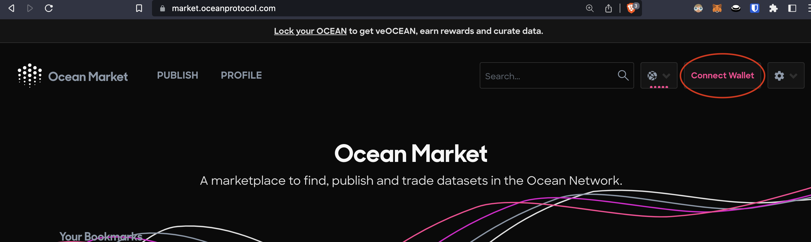
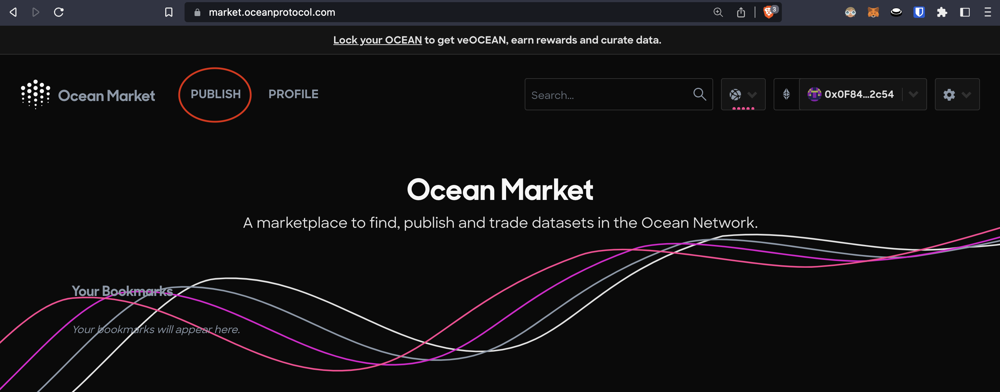
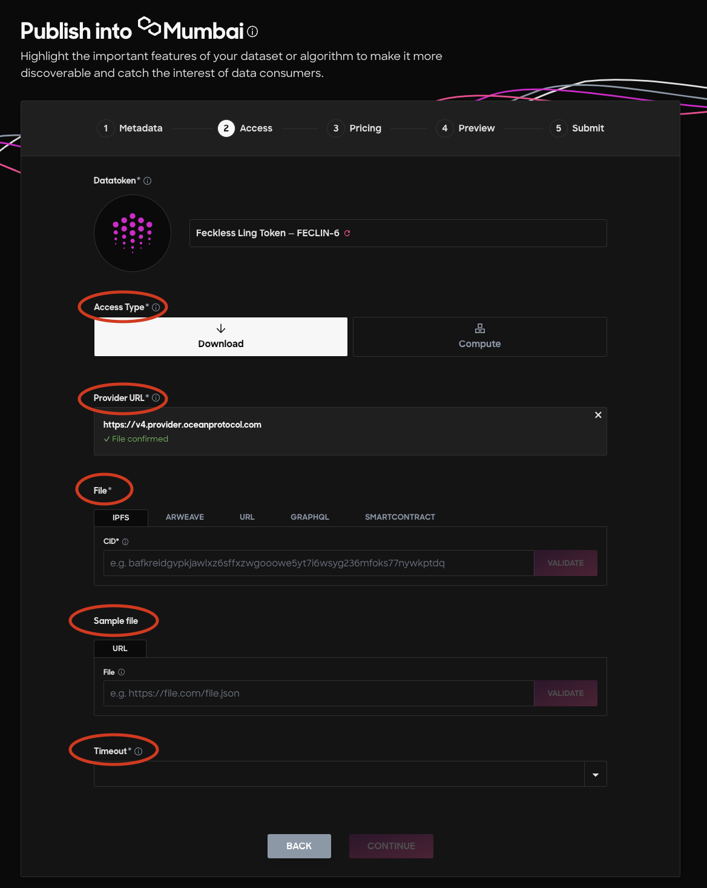
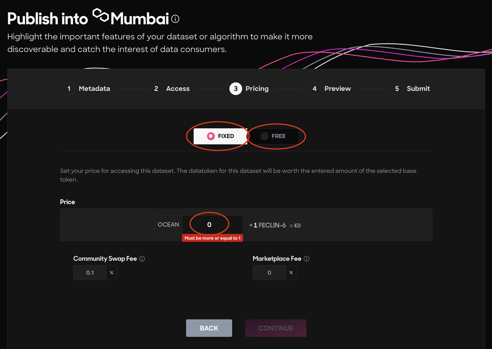
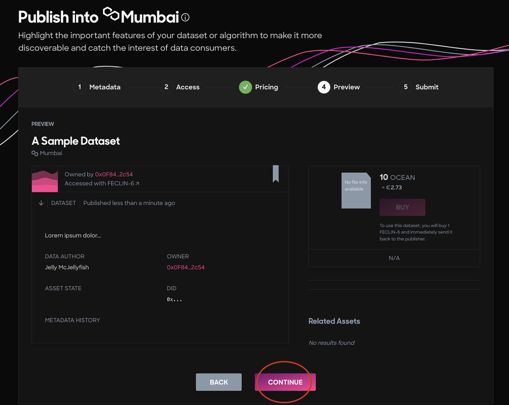
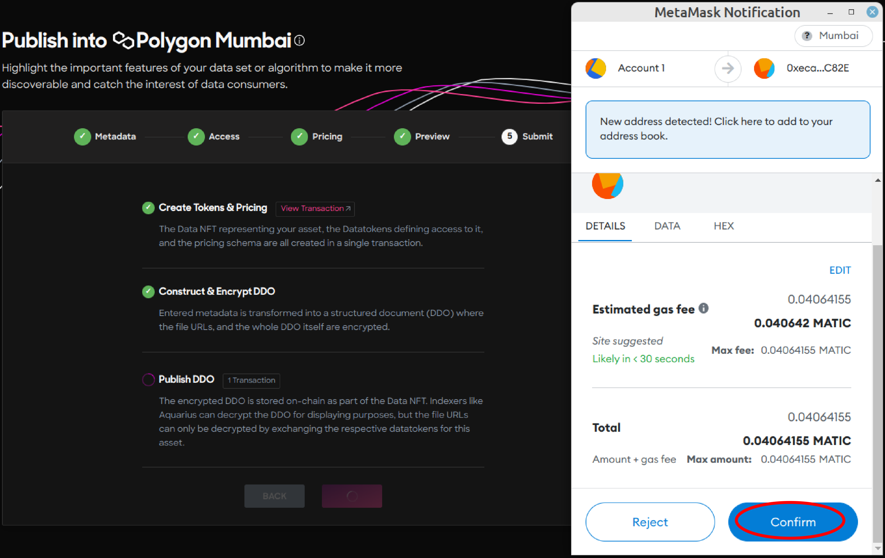
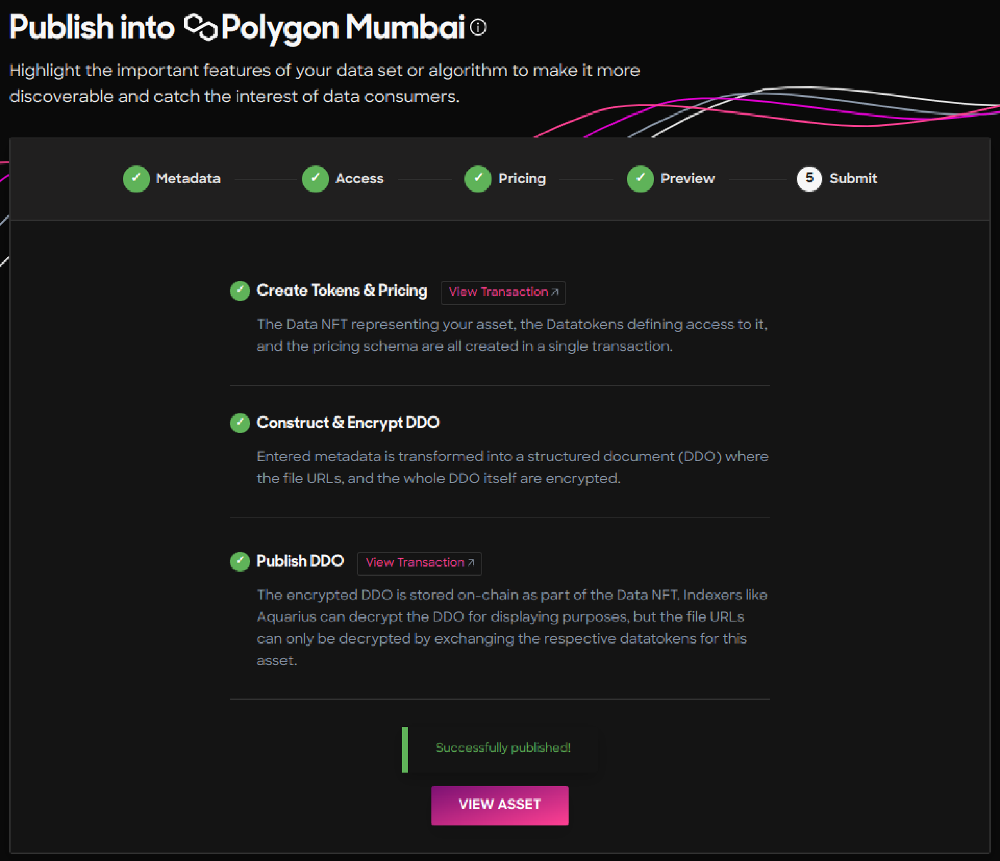

# Publish Data NFTs

<figure><figcaption></figcaption></figure>

### What to Publish? 🤷‍♀️

Ocean Protocol has a convenient marketplace, called the Ocean Market, for publishers and consumers of data. What data, you ask? This data spans anything from .CSVs and .XLSX files to images, audio, videos, algorithms in any language, or combinations of all these things! There is no exhaustive list of what type of data can be published on the Ocean Market.

### What does it mean to publish an NFT using Ocean Protocol?

The publishing process on the Ocean Market both mints (i.e. creates) a data NFT and a corresponding datatoken for your IP. The data NFT stores your IP, and the datatoken controls access to it. If you publish your music IP on the Ocean Market, for example, then a data NFT containing your music and its datatoken are minted during the publishing process. When consumers purchase the datatoken, then they gain access to download/use your data NFT's music.

### How to Publish an NFT on the Ocean Market 🧑‍🏫

### Code flow:

* **Python:** Are you looking how to publish a data NFT using Python? Follow our ocean.py [Publish Flow](../developers/ocean.py/publish-flow.md) to mint a data NFT and datatoken using Python.
* **Javascript**: Are you looking how to publish a data NFT using Javascript? Follow our ocean.js [Publish Flow](../developers/ocean.js/publish.md) to mint a data NFT and datatoken using Javascript.

### No code flow:


Don't enjoy reading? Watch our video tutorial!


#### Getting Started 🏃💨

1. Go to the [Ocean Market](https://v4.market.oceanprotocol.com).
2. Connect your wallet.
3. Select the network where you would like to publish your NFT (ex. Ethereum, Polygon, etc).

<figure><figcaption></figcaption></figure>

In this tutorial, we will be using the Polygon Mumbai test network.

4\. Click on the Publish link on the top left corner of the page.

<figure><figcaption></figcaption></figure>

#### Step 1 - Metadata 🤓

Fill in the metadata.

_Mandatory fields are marked with \*_

*   **Asset type**\*

    An asset can be a _dataset_ or an _algorithm_. The asset type cannot be changed after publication.
*   **Title**\*

    The descriptive name of the asset. This field is editable after the asset publication.
*   **Description**\*

    Description of the asset. Ocean Marketplace **supports Markdown** and plain text formats for the description field. Feel free to enrich your NFT's description with GIFs, videos, images, etc! This field is editable after the asset publication.
*   **Author**\*

    The author of the asset. The author can be an individual or an organization. This field is editable after the asset publication.
*   **Tags**

    Tags help the asset to be searchable. If not provided, the list of tags is empty by default.

<figure><figcaption></figcaption></figure>

Click Continue.

#### Step 2 - Access details 🔑

_Mandatory fields are marked with \*_

*   **Access Type**\*

    An asset can be either a downloadable file or a compute job on a dataset which buyers can run their algorithm. Through **download**, buyers will be able to download the data in the NFT. Through **compute**, buyers will be able to purchase a compute job on a dataset to see an output feed (see Compute-to-Data).
*   **Provider URL**\*

    The Provider server encrypts the URL to the data and allows for the asset to be downloaded by buyers or for compute jobs.
*   **File**\*

    The direct URL to the data. **Provider** encrypts this field before publishing the asset on-chain to hide the source of the data. The direct URL to the file needs to be **publicly accessible** so that the file can be downloaded by buyers (data hosted behind firewalls will not work!). If the file is hosted on services like Google Drive, then the URL needs to point directly to the data asset file. Also, the file needs to have the proper permissions to be downloaded by anybody.
*   **Sample file**

    An optional field where publishers can provide a URL to a sample file of the data. Including a sample file helps to persuade buyers that the data is in a suitable format for their needs. The buyers can access it before buying the dataset. This field is editable after the asset publication.

    **Provider** encrypts this URL before publishing the asset on-chain.
*   **Timeout**\*

    This field specifies how long the buyer can access the dataset after the dataset is purchased. This field is editable after the asset publication.

<figure><figcaption></figcaption></figure>

#### Step 3 - Pricing 🫰

The publisher needs to choose a pricing option - fixed or free - for the asset before publishing the data asset. The pricing schema is not editable after the asset publication.

There are 2 pricing option tabs for asset publication on Ocean Marketplace.

1. Fixed pricing
2. Free pricing

With the _fixed pricing_ schema, the publisher sets the price that buyers will pay to download the data asset.

With the _free pricing_ schema, the publisher provides an asset that is free to be downloaded by anyone.

For more information on the pricing models, please refer this [document](../developers/contracts/pricing-schemas.md).

For a deep dive into the fee structure, please refer to this [document](../developers/contracts/fees.md).

<figure><figcaption></figcaption></figure>

#### Step 4 - Preview 🔍

<figure><figcaption></figcaption></figure>

If you are happy with the Preview of your NFT, then click Continue!

#### Step 5 - Submit Your Blockchain Transactions 💃🕺

To publish your NFT on-chain, you must go through three steps including signing two transactions with your wallet. Note: this will cost some gas fees!

#### Confirmation 🥳

Now, your NFT is successfully published and available in the Ocean Market!

On the [profile page](https://v4.market.oceanprotocol.com/profile), a publisher has access to all their published assets.

#### More Info 🧐

Your data or algorithm NFT is \*published\* on-chain once you complete the flow. However, you are not selling the actual NFT on-chain - **you are selling datatokens** that give buyers **access** to the NFT's data. More on this distinction in the Ocean Basics video tutorial.


Learn more about the publishing flow!


**Note:** Ocean Protocol maintains a purgatory list [here](https://github.com/oceanprotocol/list-purgatory) to block addresses and remove assets for any violations.

### Related Articles 📖

[https://blog.oceanprotocol.com/on-selling-data-in-ocean-market-9afcfa1e6e43](https://blog.oceanprotocol.com/on-selling-data-in-ocean-market-9afcfa1e6e43)
