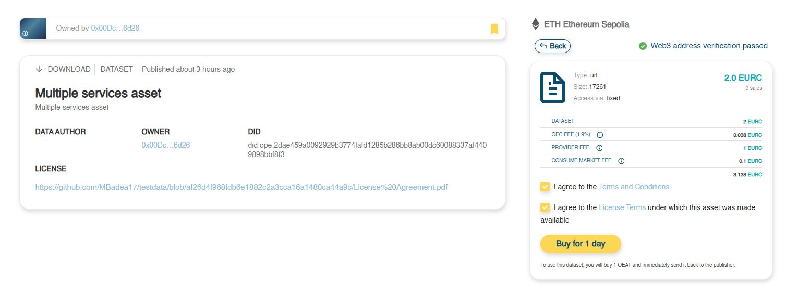

# Consuming an asset's service

Consuming an asset’s service means accessing its URI and retrieving the result on your local machine. Depending on the type of resource available at the URI, this may involve:

* Downloading a file directly to your local system.
* Calling an API endpoint and retrieving the returned results.
* Running a GraphQL query and collecting the query’s output.

<mark style="color:$info;background-color:$info;">**Note**</mark><mark style="color:$info;background-color:$info;">: Only services of type</mark> <mark style="color:$info;background-color:$info;"></mark><mark style="color:$info;background-color:$info;">`access`</mark> <mark style="color:$info;background-color:$info;"></mark><mark style="color:$info;background-color:$info;">can be consumed as listed above. Services of type</mark> <mark style="color:$info;background-color:$info;"></mark><mark style="color:$info;background-color:$info;">`compute`</mark> <mark style="color:$info;background-color:$info;"></mark><mark style="color:$info;background-color:$info;">can only be used in a C2D job.</mark>&#x20;

For a consumer to access an asset's service, the following conditions must be met:

* **Access Rights**: the consumer must be authorized to access both the asset and the service. Authorization is evaluated at both levels (asset and service) based on:
  * The consumer’s Web3 address
  * The required verifiable credentials defined in the SSI access policies of the asset and the service
* **Payment**: If the service is paid, the consumer must purchase access by paying:
  * The service’s listed price
  * Any applicable additional fees

## Precondition

* The consumer has logged in to the marketplace

## Steps

1\. Locate the asset in the Catalogue and open it by clicking its tile. The Asset Details screen will appear, showing the available services on the right side. Each service includes information about its access type (access or compute) and price.

<figure><figcaption></figcaption></figure>

2\. Select the service you want from the service list by pressing on its tile. The marketplace will then perform an initial access verification based on the consumer's web3 address.&#x20;

<mark style="color:$info;background-color:$info;">**Note:**</mark>&#x20;

* <mark style="color:$info;background-color:$info;">If the consumer’s address passes verification, no message is shown on the screen.</mark>&#x20;
* <mark style="color:$info;background-color:$info;">If the consumer's address fails marketplace verification, an error message is displayed (see image below).</mark>&#x20;

<figure><figcaption></figcaption></figure>

3\. Press the "**Check Credentials**" button. The next steps vary depending on whether the asset is governed by SSI-based access policies or not.&#x20;

* **The asset does not have SSI-based access policies**
  *   The consumer's address is verified by Ocean Node against the access rules defined in the asset's description.&#x20;

      * If verification succeeds:
        * An information message is displayed on-screen,
        *   The "Calculate Total Price" button is shown.&#x20;

            <figure><figcaption></figcaption></figure>

      * If verification fails
        * An error message is displayed on-screen
        *   The "Retry" button is shown

            <figure><figcaption></figcaption></figure>

* **The asset has SSI-based access policies**
  * In accordance with the SSI policies defined at the asset and service levels, the marketplace receives a request for the consumer to present one or more verifiable credentials from the consumer's SSI wallet.  &#x20;
    *   The marketplace retrieves from the consumer's SSI wallet the verifiable credentials that correspond to the SSI policy criteria.&#x20;

        *   If no verifiable credentials correspond to the SSI policy criteria, a message stating that no credentials were found is displayed.

            <figure><figcaption></figcaption></figure>

        *   If one or more verifiable credentials are found, a window with all found verifiable credentials is displayed

            <figure><figcaption></figcaption></figure>
    * Select the verifiable credentials to present and press **"Accept**".
    *   The DID Selector window is displayed. Select the DID that will be used to sign the verifiable presentation in which the selected verifiable credentials will be sent for verification. Then press "**Confirm**". 

        <figure><figcaption></figcaption></figure>
    * The verifiable credentials are submitted for verification against the SSI policy defined in the asset metadata
      * If the verification fails, an error message will be displayed on-screen.
      *   If verification succeeds:

          * An information message is displayed on-screen
          *   The "**Calculate Total Price**" button is shown.&#x20;

              <figure><figcaption></figcaption></figure>

          &#x20;&#x20;

4\. Click "**Calculate Total Price**".

<figure><figcaption></figcaption></figure>

&#x20;&#x20;

5\. The detailed list of costs associated with the purchase of the asset is shown.&#x20;

* Check the "I agree to the Terms and Conditions" checkbox. The Terms and Conditions can be reviewed by clicking on the link.
* Check the "I agree to the License Terms under which this asset was made available". The License Terms of the asset can be reviewed by clicking on the link
* Click "**Buy**"

<figure><figcaption></figcaption></figure>

6 . Metamask wallet will display a spending cap request. Click "**Confirm**".

<figure><figcaption></figcaption></figure>

6\. Metamask wallet will display a transaction request. Click "**Confirm**".

<figure><figcaption></figcaption></figure>

7.  The service is purchased, and the "**Download**" button is displayed.&#x20;

    <figure><figcaption></figcaption></figure>

<mark style="color:$info;background-color:$info;">**Note**</mark><mark style="color:$info;background-color:$info;">: If a service requires consumer parameters, the corresponding fields for entering values will be displayed (see picture below). The user must enter a value for each mandatory field to enable the "Download" button.</mark>&#x20;

<figure><figcaption></figcaption></figure>

8\. Click "**Download**". Metamask wallet will display a signature request message.&#x20;

<figure><figcaption></figcaption></figure>

9\. The result of accessing the service's URI is downloaded. &#x20;

<figure><figcaption></figcaption></figure>

