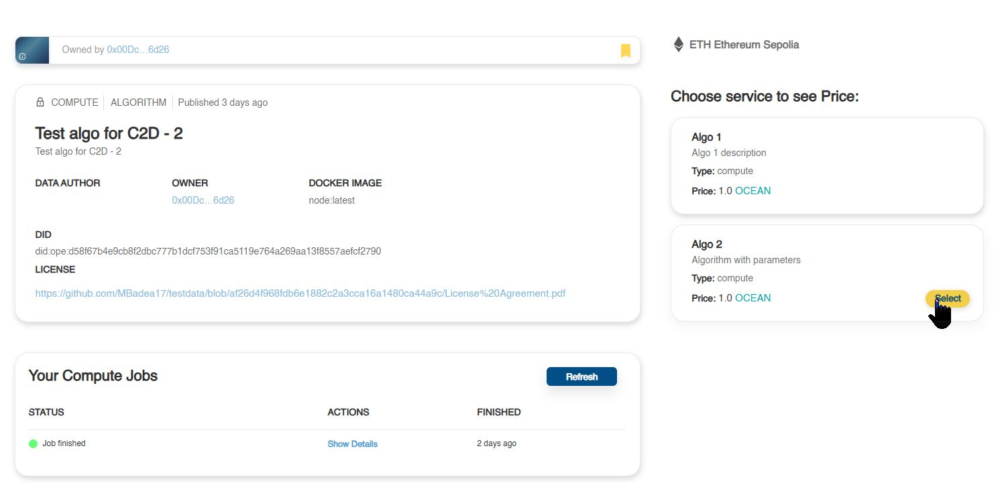
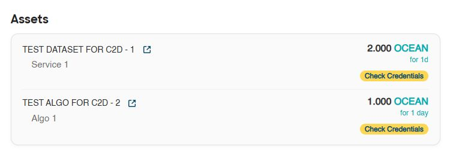

# Run a C2D job starting from an algorithm

## Precondition

* The user is logged in to the marketplace

## Steps

1\. Access the Catalogue. The catalogue lists all registered assets - datasets and algorithms - of any type - download or compute.

<figure><figcaption></figcaption></figure>

**Note**: to refine your selection in the catalogue, use the search bar at the top of the list or the filters available on the left side of the catalogue

2\. Select an algorithm from the list. The asset details page is displayed.

<figure><figcaption></figcaption></figure>

3\. From the services list, select a service of type _compute_. The "**Start Compute**" button is displayed.&#x20;

<figure><figcaption></figcaption></figure>

4\. Click "**Start Compute**". The C2D wizard is started, and Step 1 - Select Datasets window is shown.

<figure><figcaption></figcaption></figure>

5\. This screen lists only the datasets that include services on which the selected algorithm can run (see [Service Metadata and Credentials](../../publishing-an-asset/service-metadata-and-credentials.md)).

When running a C2D job starting from an algorithm, you can select zero or more datasets on which the algorithm will be executed.&#x20;

a) **Run C2D job without datasets:** If no datasets are needed to run the algorithm, mark the "Proceed without Dataset Selection" checkbox. This will disable the datasets list, remove unnecessary steps from the wizard, and enable the Continue button. Click **Continue**, then move to step 8 of this page.

<figure><figcaption></figcaption></figure>

b) **Run C2D job with one or more datasets:** If one or more datasets are needed to run the algorithm, select them from the list by clicking on their tiles. The "Selected" status will be displayed next to the asset's name, and the Continue button will be enabled. Click **Continue**.&#x20;

<figure><figcaption></figcaption></figure>

6\. The "**Select Services**" page appears, showing the assets chosen in the previous step along with the services on which the algorithm can run. Select the services you want to run the algorithm on and click **Continue**.&#x20;

<figure><figcaption></figcaption></figure>

7\. The "**Preview Selected Datasets and Services**" screen is displayed, showing the selection made so far. If you're satisfied with the selected dataset services, press **Continue**.

<figure><figcaption></figcaption></figure>

8\. If any of the selected services (datasets or algorithms) contain consumer parameters, the **User Parameters** screen will open. It displays all parameters along with their default values. Provide the required inputs and select **Continue**.&#x20;

<figure><figcaption></figcaption></figure>

9\. The **"Select C2D Environment"** screen appears. Here you’ll see the Ocean Nodes linked to the dataspace that can run C2D jobs. Each node shows which environments are available—free, paid, or both. Select a node and press **Continue**.

<figure><figcaption></figcaption></figure>

<mark style="color:$info;background-color:$info;">**Note**</mark><mark style="color:$info;background-color:$info;">: At present, the list displays only the node linked to the dataspace. Future releases of OE will support multiple nodes serving a single dataspace.</mark>

9\. The **C2D Environment Configuration** screen opens. Here you’ll see the available environments for the selected Ocean Node. Each environment lists its resources, and if you choose a paid environment, you’ll also see the per‑minute price for each resource.&#x20;

* Select the environment
* Set the resources your job will use
* Choose the maximum job duration. \
  <mark style="color:$info;background-color:$info;">**Note:**</mark> <mark style="color:$info;background-color:$info;"></mark><mark style="color:$info;background-color:$info;">For the paid environment, the C2D Environment Price field shows the total cost for the selected duration. You’ll also see a message about your escrow account balance—whether it’s enough to cover the job cost or if you need to deposit more. For more details, check the job cost and escrow account page.</mark>
* When you’re ready, confirm the configuration and click **Continue**.

<figure><figcaption></figcaption></figure>

10\. The "**Review**" screen opens.&#x20;

<figure><figcaption></figcaption></figure>

This screen is divided into three sections: Assets, C2D Resources, and Fees.

* _Assets_
  * Displays the price of each selected asset (algorithms and datasets).
  *   Includes a credential verification button next to each asset

      <figure><figcaption></figcaption></figure>

* _C2D Resources_&#x20;
  * Shows the calculated cost of the C2D job.
  * Displays the user’s escrow account balance.
  *   Indicates the additional amount to deposit if the job cost exceeds the current escrow balance. 

      <figure><figcaption></figcaption></figure>

* Fees: List applicable fees, organized into the following categories:
  * Marketplace fees (datasets and algorithms)
  * OEC fees (datasets and algorithms)
  *   Provider fees (datasets and algorithms)\
      <mark style="color:$info;background-color:$info;">**Note**</mark><mark style="color:$info;background-color:$info;">: the Provider fee is not displayed initially. It is calculated after the assets' credentials are verified.</mark> 

      <figure><figcaption></figcaption></figure>

a) In the Assets section, click the "**Check Credential**" button next to one of the assets to initiate the asset credentials verification process. The process will verify the consumer's credentials against the access rules defined for any asset. The verification is performed asset by asset.&#x20;

<figure><figcaption></figcaption></figure>

b) If the current asset has SSI-based access policies defined, then the marketplace will run a query in the consumer's SSI wallet and list the Verifiable Credentials that match the specified criteria. Select the Verifiable Credentials you want to send for verification and click **Accept**.

<figure><figcaption></figcaption></figure>

&#x20;

c) The DID selector window is open, containing the list of all DIDs from the SSI wallet. Select the DID you want to use to sign the Verifiable Presentation in which the Verifiable Credentials selected in the previous step will be wrapped before being sent for verification. Then click **Confirm**.

<figure><figcaption></figcaption></figure>

d) Credential verification is performed, and each asset is marked with the Verified tag. For assets protected by SSI-based access control, the verification session remains valid only for a limited time. Within this period, the C2D job must be initiated; otherwise, it will fail. A countdown timer is displayed to indicate the remaining validity. If the validity time expires, you will have to reinitiate the credential verification process.

<figure><figcaption></figcaption></figure>

**Note 1**: <mark style="color:$info;background-color:$info;">If credential verification fails, the system displays an error message, and the C2D job cannot be executed. To proceed, you must either supply alternative credentials for verification or select different assets.</mark>

e) If the credential verification succeeds, the user has to check the two checkboxes at the bottom of the screen to confirm:&#x20;

* agreement with the marketplace Terms and Conditions, and&#x20;
* agreement with the license terms governing each selected asset.&#x20;

<figure><figcaption></figcaption></figure>

**Note**: <mark style="color:$info;background-color:$info;">To view the license terms for an asset, click the link provided next to it. The link opens the asset details page in a new browser tab</mark>.

<figure><figcaption></figcaption></figure>

f) Click **Calculate Extra Fees**. The provider fees will be retrieved and displayed in the Fees section. &#x20;

<figure><figcaption></figcaption></figure>

&#x20;

g) Review the total cost associated with running the C2D job and click **Buy Compute Job**.&#x20;

<figure><figcaption></figcaption></figure>

h) Next, there will be multiple interactions with the Metamask wallet for spending cap approvals and payments, as the user purchases each asset and transfers money into the escrow account.&#x20;

<figure><figcaption></figcaption></figure>

i) At the end, a message will notify the user that the C2D job was started. Click **Continue**.

<figure><figcaption></figcaption></figure>

j) The user will be returned to the Service Details screen, and the C2D job will appear in the Your Compute Jobs list. Click **Refresh** to monitor the job's status.

<figure><figcaption></figcaption></figure>

k) When the job finishes, click **Show Details**.&#x20;

<figure><figcaption></figcaption></figure>

l) The Job Details page is displayed. It shows the assets used to execute the job, along with information such as the actual job duration and cost. The Results section provides links to the job’s logs and output files. To download a file, click its name in the list.

<figure><figcaption></figcaption></figure>

