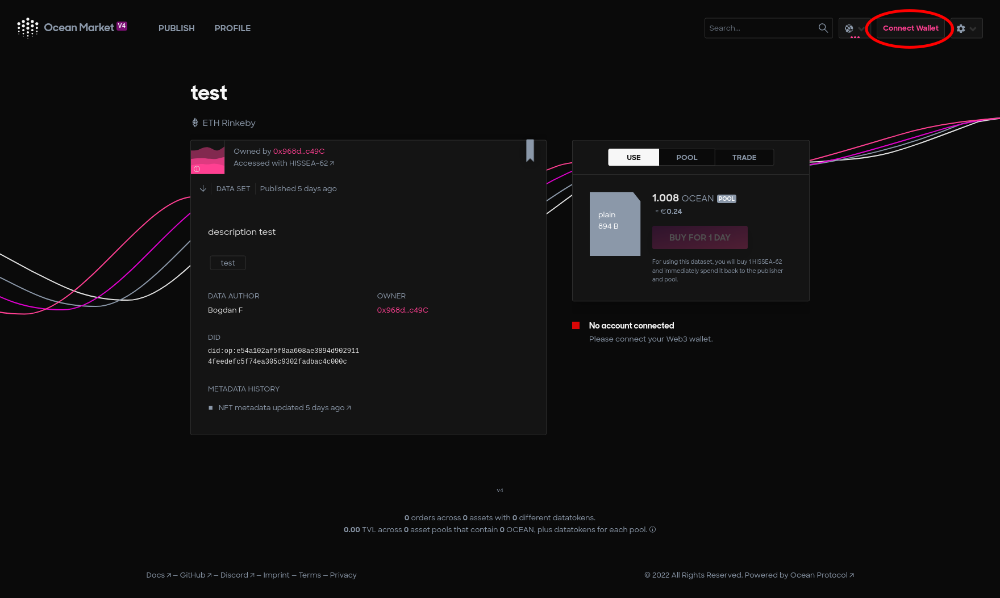
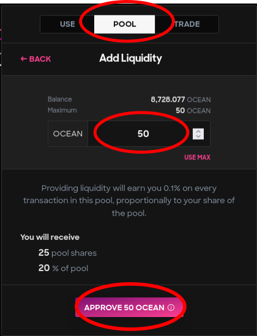
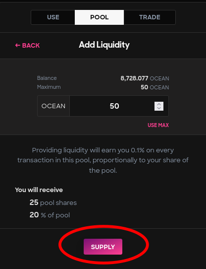

# Add liquidity to liquidity pools

### Access marketplace

1. Go to Ocean [Marketplace](https://v4.market.oceanprotocol.com/).
2. Search for the data asset. The Ocean Marketplace provides features to search the Data/Algorithms by text, and users can also sort the result by published date.
3.  Connect wallet.

### Tutorial

#### Find an asset

Search for the desired asset published on the [Ocean Marketplace](https://v4.market.oceanprotocol.com/).

#### Step 1 - Select pool tab

After finding the dataset, select **`POOL`** tab and click on **`ADD LIQUIDITY`**.

#### Step 2 - Liquidity amount

Enter the amount of OCEAN tokens you want to add. The expected amount of pool shares and percentages for the provided amount will be displayed.

#### Step 3 - Transaction: Access to OCEAN tokens

#### Step 4 - Click supply

#### Step 5 - Transaction: Add liquidty

