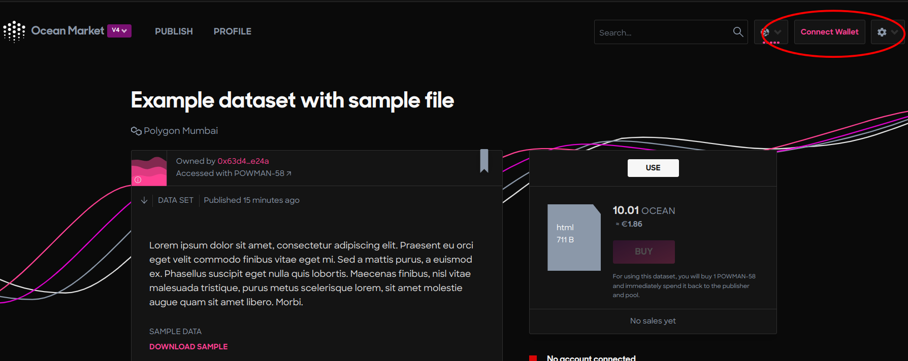
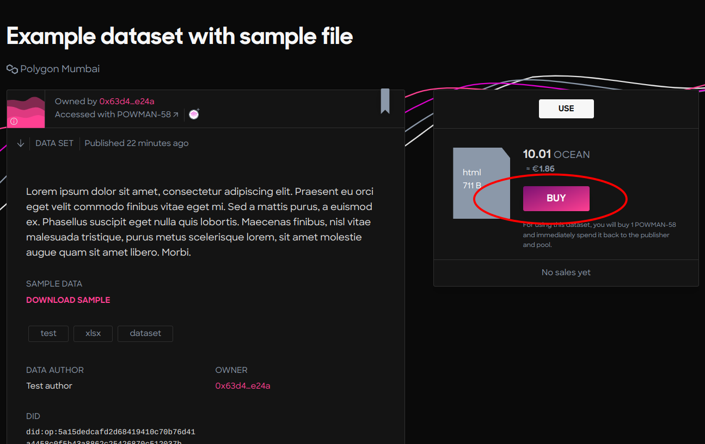
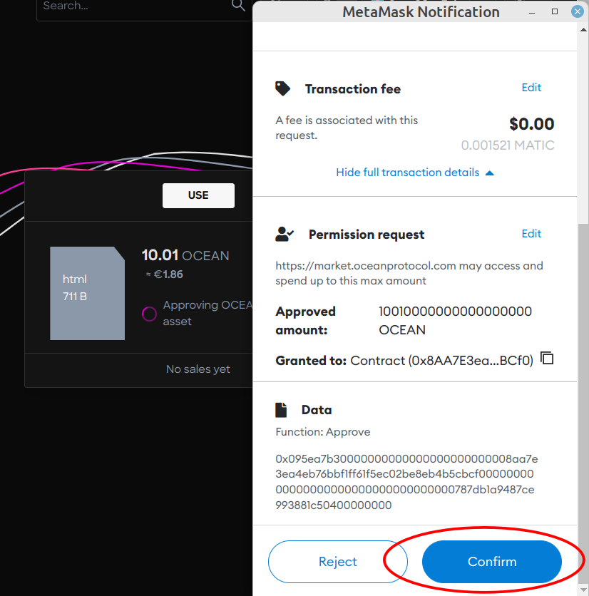
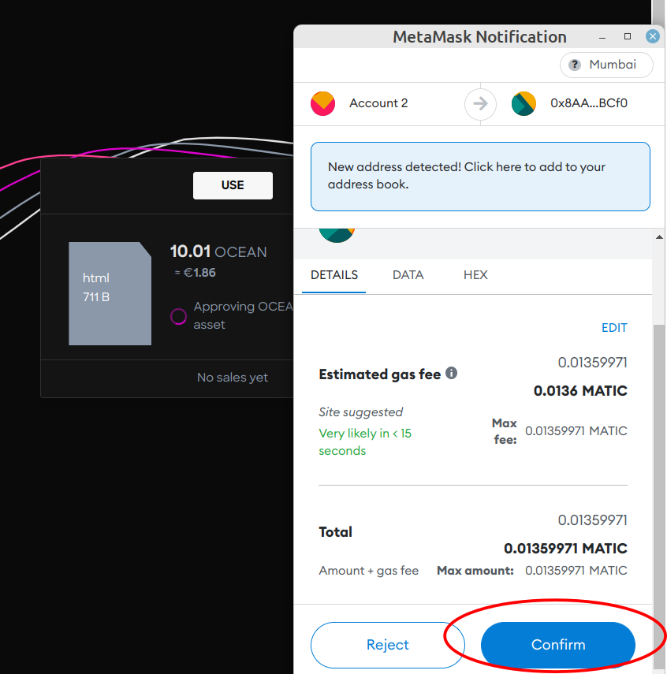
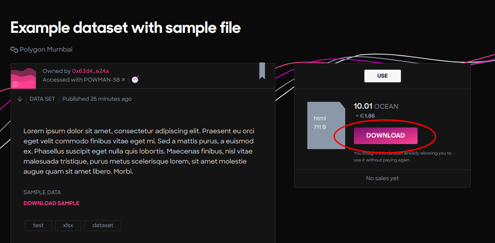
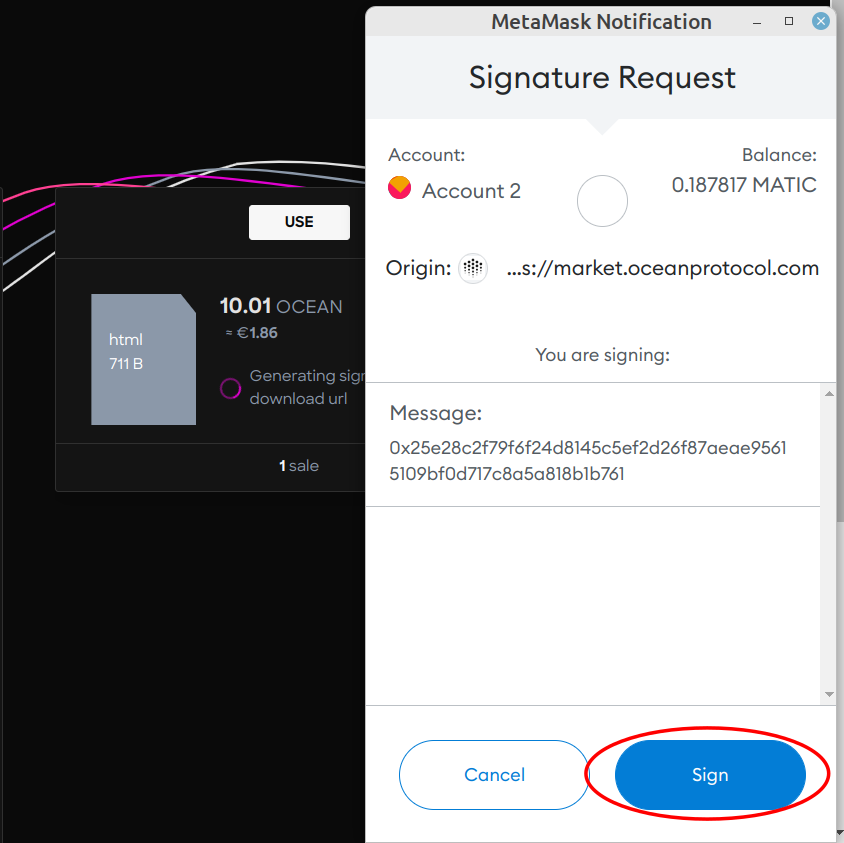

# Download a Data Asset

### Access marketplace

1. Go to Ocean [Marketplace](https://v4.market.oceanprotocol.com/).
2. Search for the data asset. The Ocean Marketplace provides features to search the Data/Algorithms by text, and users can also sort the result by published date.
3. Connect wallet.



```
In this tutorial, we will be using the Rinkeby test network.
```

### Tutorial

#### Step 1 - Click buy

The buy button is enabled only if the connected wallet address has enough OCEAN tokens to exchange them with 1 datatoken.



#### Step 2 - Allow access to OCEAN token(s)



#### Step 3 - Buy a datatoken by exchanging it with OCEAN token(s)



#### Step 4 - Click download



#### Step 5 - Sign message

After signing the message, the file download will start.


