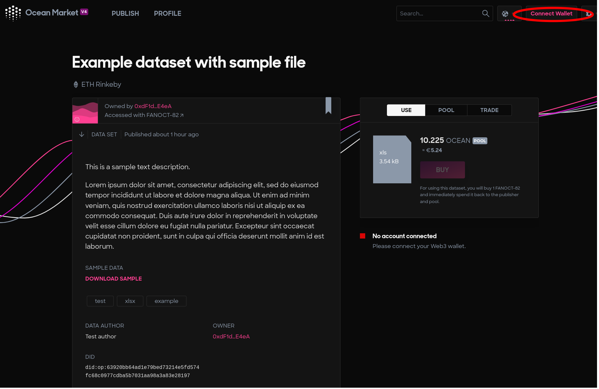
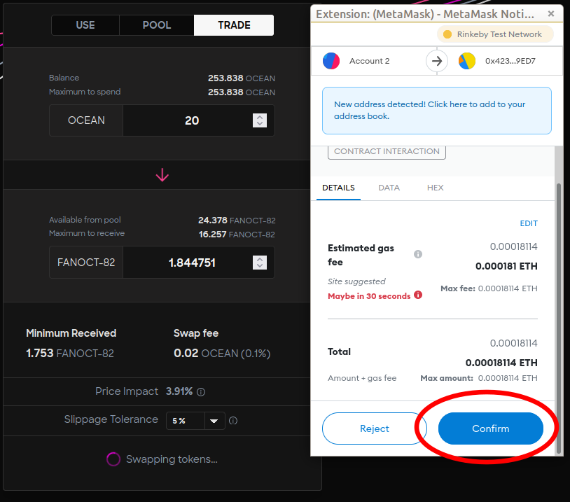
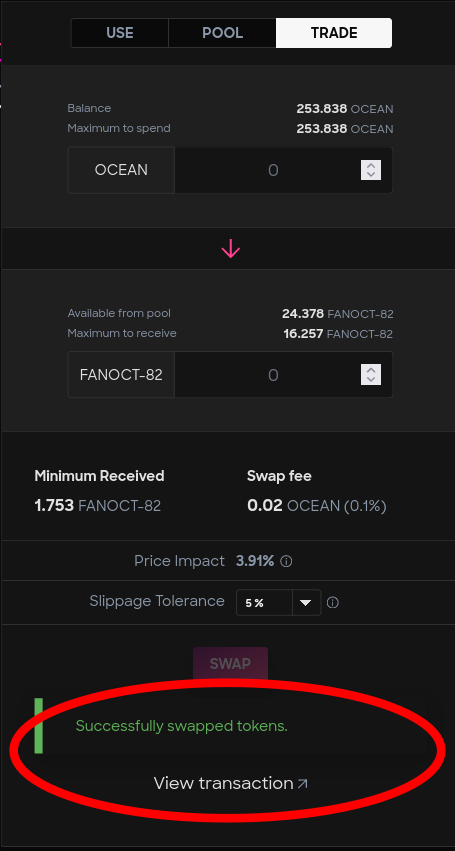

# Swap datatokens

### Access marketplace

1. Go to Ocean [Marketplace](https://v4.market.oceanprotocol.com/).
2. Search for the data asset. The Ocean Marketplace provides features to search the Data/Algorithms by text, and users can also sort the result by published date.
3.  Connect wallet.

    

### Tutorial

#### Step 1 - Select TRADE tab

After finding the dataset, select the **`TRADE`** tab.

#### Step 2 - Trade amount

Enter the amount of OCEAN tokens to swap. The datatokens amount to receive is displayed with the swap fees information. The reverse operation(swap datatokens to OCEAN tokens) is also available on the trade tab.

#### Step 3 - Transaction: Access to OCEAN token(s)

#### Step 4 - Click swap

#### Step 5 - Transaction: Swap tokens

