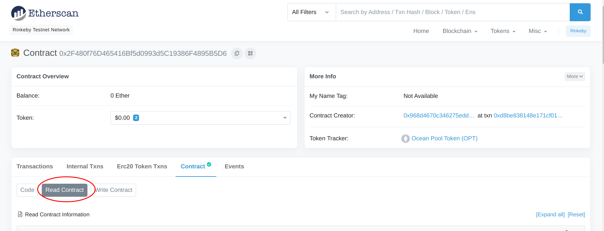
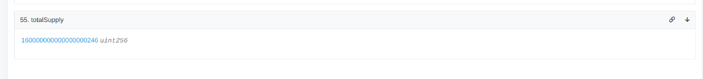
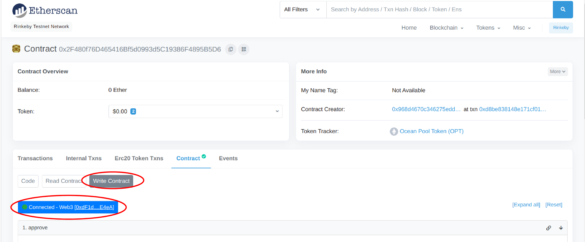
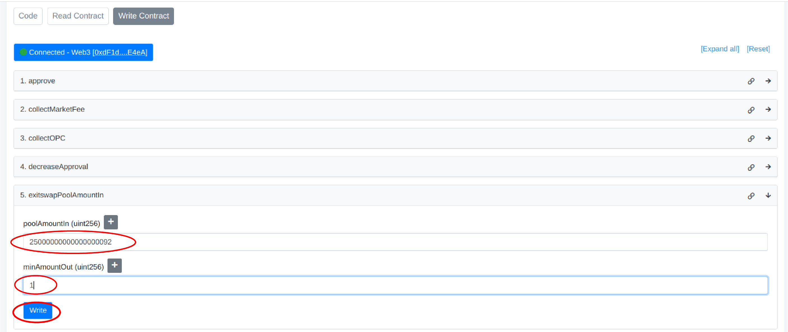
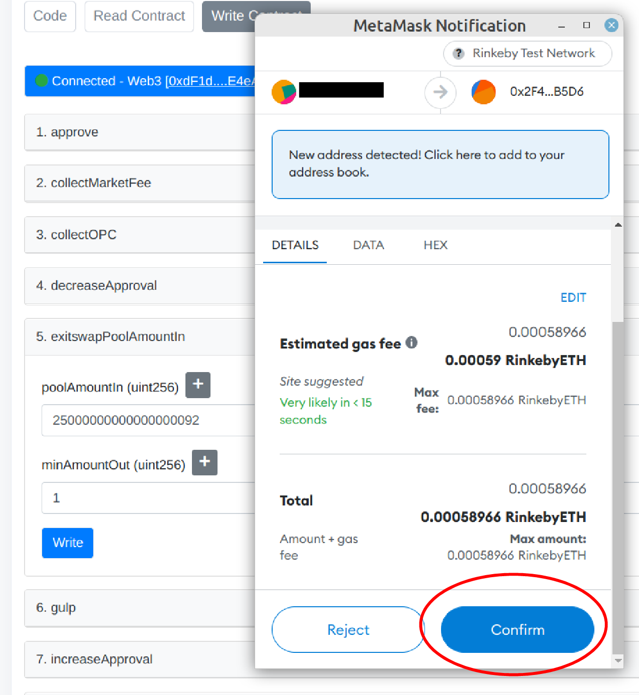

# Remove liquidity using Etherscan

## Get your balance of pool share tokens

1. Go to the pool's Etherscan/Polygonscan page. You can find it by inspecting your transactions on your account's Etherscan page under _Erc20 Token Txns_.
2. Click _View All_ and look for Ocean Pool Token (OPT) transfers. Those transactions always come from the pool contract, which you can click on.
3. On the pool contract page, go to _Contract_ -> _Read Contract_.

4. Go to field `20. balanceOf` and insert your ETH address. This will retrieve your pool share token balance in wei.

5. Copy this number as later you will use it as the `poolAmountIn` parameter.

6. Go to field `55. totalSupply` to get the total amount of pool shares, in wei.

7. Divide the number by 2 to get the maximum of pool shares you can send in one pool exit transaction. If your number retrieved in former step is bigger, you have to send multiple transactions.

8. Go to _Contract_ -> _Write Contract_ and connect your wallet. Be sure to have your wallet connected to network of the pool.

9. Go to the field `5. exitswapPoolAmountIn`

* For `poolAmountIn` add your pool shares in wei
* For `minAmountOut` use anything, like `1`
* Hit _Write_

10. Confirm transaction in Metamask

