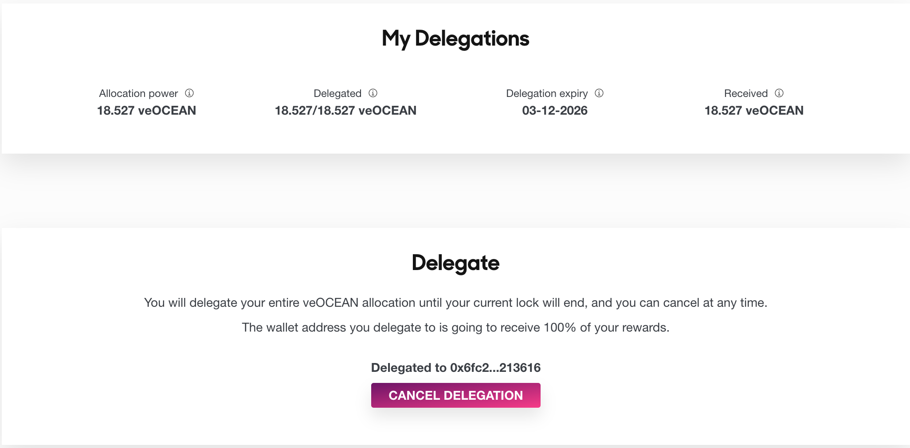

## Delegation

Delegation allows you to temporarily transfer your veOCEAN allocation power to another wallet address. This feature enables you to earn a higher annual percentage yield (APY) by delegating to an address that efficiently manages your allocation, without the need for reallocation and transaction fees.

If you have multiple wallets, delegation enables you to manage your allocations with just one wallet address.

When you delegate, you transfer 100% of your veOCEAN allocation power for a limited period. After delegation, you cannot manage your allocations until the delegation expires. The delegation expiration date is the same as the veOCEAN lock end date at the time of delegation. If necessary, you can extend your lock before delegating. You can cancel your delegation at any time.

Once delegated, rewards will be sent to the wallet address you delegated to. The delegation receiver is in charge of your rewards and the process of returning those back to you.

Follow these steps to delegate you veOcean:

1. Go to the DF Portal and select the wallet address you wish to delegate to.
2. Click the Delegate button and sign the transaction. You can view information about your delegation in the My Delegations component.
3. If needed, you can cancel the delegation to regain your allocation power before the delegation expires.

If you receive veOCEAN allocation power from other wallets, you will receive their rewards and be responsible for distributing rewards to the delegators. You cannot delegate the veOCEAN you received from delegates, only the veOCEAN you received from your lock.
