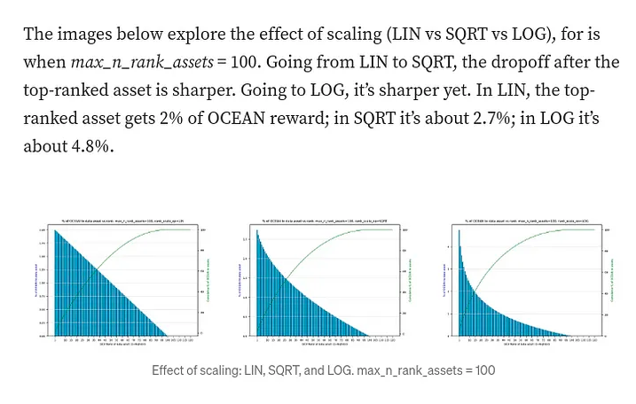

# Data Farming 101

Data Farming (DF) incentivizes for growth of Data Consume Volume (DCV) in the Ocean ecosystem.

It rewards OCEAN to liquidity providers (stakers) as a function of consume volume and liquidity. It’s like DeFi liquidity mining, but tuned for data consumption. DF’s aim is to achieve a minimum supply of data for network effects to kick in, and once the network flywheel is spinning, to increase growth rate.

## Reward Categories
Rewards are paid in OCEAN and distributed every week on Thursday as follow:

| Passive Rewards | Active Rewards |
| ---- | ------- |
| 50%    | 50%    |

Active Rewards are governed and defined by the [Reward Function](df-background.md#reward-function).

**Final Caveat:** We reserve the right to make reasonable changes to these plans, if unforeseen circumstances emerge.

## How to access DF and claim rewards

Please [follow this tutorial](../rewards/veOcean-Data-Farming-Tutorial.md) to learn how the Ocean Protocol reward programs work, and how to access them.

Otherwise, go to the DF webapp at [df.oceandao.org/activerewards](df.oceandao.org/activerewards) and explore Data Farming for yourself.

### Where to claim?  
All earnings for veOCEAN holders are claimable on the ”Rewards” page inside the Data Farming webapp on Ethereum mainnet.  

Data assets for DF may published in any [network where Ocean’s deployed in production](https://docs.oceanprotocol.com/core-concepts/networks): Eth mainnet, Polygon, etc.

### When to claim?
There are fresh rewards available every Thursday. If you wish, you can wait for many weeks to accumulate before claiming. (It’s all on-chain.)

### When to do a first claim?
From the time you lock OCEAN, you must wait at least a week, and up to two weeks, to be able to claim rewards.  

The nerdy version: if you lock OCEAN on day x, you’ll be able to claim rewards on the first weekly ve “epoch” that begins after day x+7.  

This behavior is inherited from [veCRV](https://curve.readthedocs.io/dao-fees.html); [here’s the code](https://github.com/oceanprotocol/contracts/blob/main/contracts/ve/veFeeDistributor.vy#L240-L256).

## DF Main

DF Main started Mar 16, 2023 in DF Round 29. DF29 has 150K OCEAN rewards available (a 2x increase from DF28). As DF Main progresses, rewards will increase to 300K (another 2x), then 600K (another 2x), then beyond 1.1M OCEAN/week (near 2x) then decaying over time.

As of DF29, wash consuming will no longer be profitable. So, organically-generated Data Consume Volume will be the main driver of active DF rewards.

[Example APYs are 5–20%](emissions-apys.md#example-apys) between Passive & Active rewards.

Full implementation of DF Main will be over many months, after which DF will be decentralized.

DF Main lasts for decades.

## Reward Schedule

The table below cross-references DF Round Number, Start Date, Phase & Week, Sub-Phase & Week, and OCEAN Rewards/Week.

_Ocean Reward Schedule for the next 20+ years_

## Ranked Rewards
In DF23 Ranked Rewards were introduced and smooth the reward distribution by using a logarithmic function.

**Since rewards are distributed across the Top 100 assets (current tuning Mar — 2023), all participants (Publishers & Curators) are now incentivized to support a broader range of assets rather than optimizing on a single asset.**

At the top-end, this helps increase quality and diversification of inventory.

At the bottom-end, this eliminates some potential free-rider issues and smooths out the reward distribution.

You can read more about the implementation [in this blog post](https://blog.oceanprotocol.com/data-farming-df22-completed-df23-started-reward-function-tuned-ffd4359657ee) and find the full study [in these slides](https://docs.google.com/presentation/d/1zZdWfywruMPt6r7vfl0nQD8Fgj4wkfuMslZcWJmy3GE/edit?usp=sharing).

## 2x Stake - Publisher Rewards
As part of our efforts to increase the efficiency of the Reward Function, we researched a broad range of improvements that could be implemented and discussed their many outcomes.

One particular improvement was noted, how to structure incentives to also align publishers.

We explored dozens of possible ways to do it. In the end, we arrived at this approach. It was chosen for it’s simplicity and ease of understanding.

### For publishers, effective 2x Stake

For Data Farming, we want to incentivize publishers to create more data sets, build more token-gated product, innovate how builders can consume Data-tokens.

*All the veOCEAN a publisher has allocated to an asset they’ve published (“staked”) is treated as 2x the stake for rewards calculation.*
1. As a staker, due to their staked veOCEAN on their own assets (1x).
1. As a publisher, for having veOCEAN staked on their own asset(1x).

The final reward is then calculated and bundled together to be distributed.

You can read more about the implementation [in this blog post](https://blog.oceanprotocol.com/data-farming-publisher-rewards-f2639525e508).