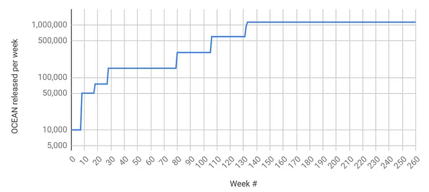
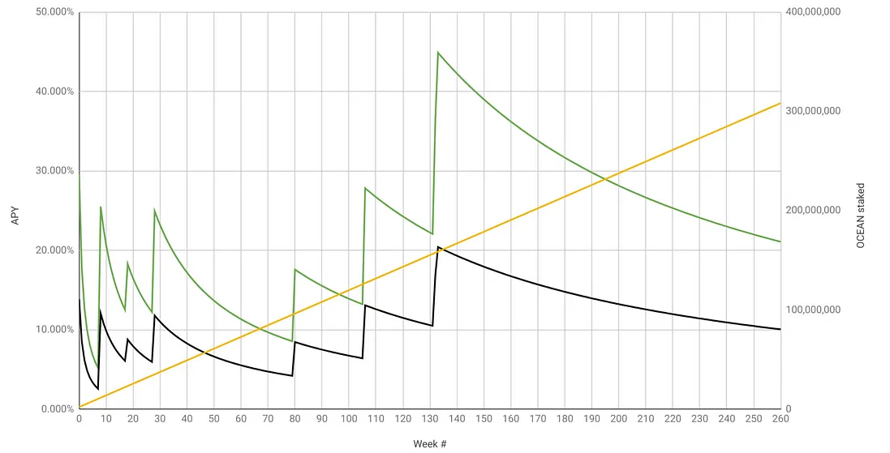

# Emissions & APYs

With veOCEAN, OceanDAO evolves to be more like CurveDAO:

- ve is at the heart with v = voting (in data asset curation) and e = escrowed (locked) OCEAN. The longer the lockup, the more voting and rewards, which reconciles near- and long-term DAO incentives.
- The DAO has increased bias to automation, and to minimizing the governance attack surface. The 143.8M OCEAN that was originally earmarked for a DAO treasury will go into DF instead. And, 143.8M OCEAN earmarked for grants will go to DF (>21.5M OCEAN remains for grants). This is on top of 215.7M OCEAN previously allocated . Therefore DF now has 503.4M OCEAN allocated; this is 35.7% of total OCEAN supply (1.41B OCEAN).

The baseline emissions schedule determines the weekly OCEAN budget for this phase. The schedule is like Bitcoin, including a half-life of 4 years. Unlike Bitcoin, there is a burn-in period to ratchet up value-at-risk versus time:
- The curve initially gets a multiplier of 10% for 12 months (DF Main 1)
- Then, it transitions to multiplier of 25% for 6 months (DF Main 2)
- Then, a multiplier of 50% for 6 months (DF Main 3)
- Finally, a multiplier of 100%. (DF Main 4)

We implement the first three phases as constants, because they are relatively short in duration. We implement the fourth phase as a Bitcoin-style exponential: constant, with the constant dividing by two (“halvening”) every four years.

Let’s visualize!

## Emissions — first 5 years.

The image below shows the first 5 years. The y-axis is OCEAN released each week. It’s log-scaled to easily see the differences. The x-axis is time, measured in weeks. In weeks 0–29, we can see the distinct phases for DF Alpha (DF1 // week 0), DF/VE Alpha (DF5 // week 4), DF Beta (DF9 // week 8), DF Main 1 (DF29 // week 28), DF Main 2 (DF80 // week 79), DF Main 3 (DF106 // week 105), and DF Main 4 (DF132 // week 131).

  
_OCEAN released to DF per week — first 5 years_

## Emissions — First 20 years.

The image below is like the previous one: OCEAN released per week, but now for the first 20 years. Week 131 onwards is DF Main 4. We can see that the y-value divides by two (“halvens”) every four years.

  
_OCEAN released to DF per week — first 20 years_

## Total OCEAN released.

The image below shows the total OCEAN released by DF for the first 20 years. The y-axis is log-scaled to capture both the small initial rewards and exponentially larger values later on. The x-axis is also log-scaled so that we can more readily see how the curve converges over time.

  
_Total OCEAN released to DF — first 20 years_

## Example APYs

The plot below shows estimated APY over time. Green includes both passive and active rewards; black is just passive rewards. As of DF29, wash consume is no longer profitable, so we should expect a large drop in DCV and therefore in active rewards. So passive rewards (black) provides a great baseline with upside in active rewards (green).

APYs are an estimate because APY depends on OCEAN locked. OCEAN locked for future weeks is not known precisely; it must be estimated. The yellow line is the model for OCEAN locked. We modeled OCEAN locked by observing linear growth from week 5 (when OCEAN locking was introduced) to week 28 (now): OCEAN locked grew from 7.89M OCEAN to 34.98M OCEAN respectively, or 1.177M more OCEAN locked per week.

  
_Green: estimated APYs (passive + active). Black: estimated APYs (just passive). Yellow: estimated staking_
The plots are calculated from [this Google Sheet](https://docs.google.com/spreadsheets/d/1F4o7PbV45yW1aPWOJ2rwZEKkgJXbIk5Yq7tj8749drc/edit#gid=1051477754).

OCEAN lock time affects APY. The numbers above assume that all locked OCEAN is locked for 4 years, so that 1 OCEAN → 1 veOCEAN. But APY could be much worse or more if you lock for shorter durations. Here are approximate bounds.

If you lock for 4 years, and everyone else locks for 2, then multiply expected APY by 2. If you lock for 4 years and others for 1, then multiply by 4.
Conversely, if you lock for 2 years and everyone else for 4, then divide your expected APY by 2. If you lock for 1 year and others for 4, then divide by 4.
The numbers assume that you’re actively allocating veOCEAN allocation towards high-DCV data assets. For passive locking or low-DCV data assets, divide APY by 2 (approximate).